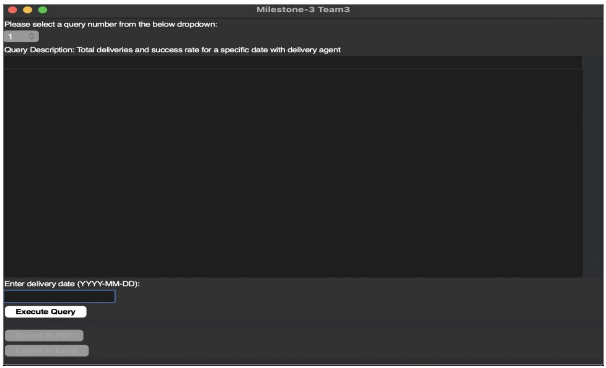

<h1 align="center">Costco Inventory Management System</h1>

<b>By: Mustafa Shabbir Bhavanagarwala</b>

## About the Project

Costco is the third-largest retailer in the world. For the proper functioning and success of 
the corporation in a locality, a well-defined inventory management system forms the 
backbone of the organization. The large amount of data owned by the organization should 
be safely stored, well maintained, and rapidly accessible by its database. Thus the project 
aims to deliver an inventory management system that involves implementing a robust 
database thereby ensuring seamless management of the vast inventory, ensuring 
accuracy, and real-time insights which would enhance the overall supply chain, reduce 
costs, and elevate the customer experience. The database is characterized by features 
such as efficient storage, data integrity, and performance optimization. Through the
project, the aim is to empower Costco to navigate the challenges of inventory 
management with confidence, resilience, and unparalleled efficiency, making a lasting 
impact on the success and sustainability of the organization.

In this project, SQL is used to build and manage the database. First the requirements for 
the Costco inventory are gathered to understand the data that needs to be managed.
Then a well defined ER diagram is built to model the data and its relationships based on 
the requirements. Now forward engineering is carried out to create actual database 
schema in a DBMS, followed by implementing indexes, constraints, and other database 
objects. The database is then populated with inventory data. Several significant SQL 
queries are built and executed upon the database. To reduce redundancy, and improve 
performance and security stored procedures are implemented. Tkinter is used to create 
the user interface to allow users to interact with the database

<ul>
<li>Logical ER Diagram</li>
</ul>

 
<ul>
<li>User Interface</li>
</ul>

This program interface allows users to select from a number of different predefined 
queries. Each query has a description that explains what data it will return. Once a user 
selects a query and enters any required parameters (like delivery date), they can execute 
the query.

 

The query results are then displayed in a table format. Users can also export the results 
to a PDF or Excel file for future reference.

 

This is how the sample downloaded output will look like in excel file.

 
<ul>
<li>Data Visualization</li>
</ul>

The graph shows the number of deliveries completed by membership tier over a period 
of time. The y-axis shows the membership tier (Gold, Platinum, Silver), and the x-axis the 
number of deliveries. 

 

The graph shows the number of successful Deliveries completed by each Delivery Agent 
and it is sorted by Agent ID. The y-axis displays the Agent ID and the x-axis the number 
of successful deliveries. 

