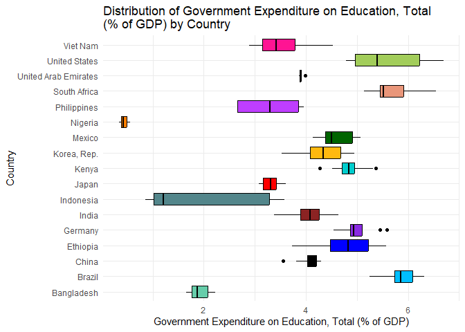
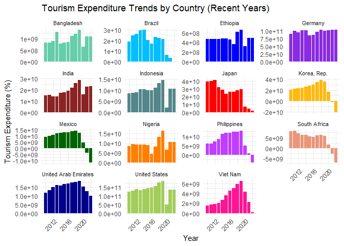

    # Read in data
    df <- read_csv("cleaned_data.csv")

    ## New names:
    ## Rows: 221 Columns: 18
    ## ── Column specification
    ## ──────────────────────────────────────────────────────── Delimiter: "," chr
    ## (1): country_name dbl (17): ...1, year, elec_access, agri_forest_fish,
    ## agri_land, arable_land,...
    ## ℹ Use `spec()` to retrieve the full column specification for this data. ℹ
    ## Specify the column types or set `show_col_types = FALSE` to quiet this message.
    ## • `` -> `...1`

    # Country colors 
    country_colors <- c("Bangladesh" = "aquamarine3", 
                        "Brazil" = "deepskyblue", 
                        "China" = "black", 
                        "Ethiopia" = "blue", 
                        "Germany" = "blueviolet", 
                        "India" = "brown4", 
                        "Indonesia" = "cadetblue4", 
                        "Japan" = "red", 
                        "Kenya" = "cyan3", 
                        "Korea, Rep." = "darkgoldenrod1", 
                        "Mexico" = "darkgreen", 
                        "Nigeria" = "darkorange1", 
                        "Philippines" = "darkorchid1", 
                        "South Africa" = "darksalmon", 
                        "United Arab Emirates" = "darkblue", 
                        "United States" = "darkolivegreen3", 
                        "Viet Nam" = "deeppink"
    )

    # subsetting data based on factors like data availability, Developmental Focus, Key Economic Players by Sector
    countries <- c("Bangladesh", "Brazil", "China", "Ethiopia", "Germany", "India", "Indonesia", "Japan", "Kenya", "Korea, Rep.", "Mexico", "Nigeria", "Philippines", "South Africa", "United Arab Emirates", "United States", "Viet Nam")

    plot <- df %>%
      select(country_name, year, pop) %>%
      pivot_wider(names_from = country_name,
                  values_from = pop) # Convert data from long to wide format

    # Compute log differences to find percentage change in population for each country
    for (country in countries) {
      plot <- plot %>%
        mutate(!!country := c(NA, diff(log(as.numeric(as.character(plot[[country]]))))))  # Log first, then diff
    }

    plot_data <- plot %>%
      dplyr::filter(year != 1990) %>% #filtering
      pivot_longer(cols = -year, # Convert data back to long format
                   names_to = "country",
                   values_to = "pop") %>%
      mutate(pop = as.numeric(as.character(pop*100)),
             country = as.factor(country))

    # Population change over time for each country
    p1 <- ggplot(plot_data, aes(x = country, y = pop, fill = country)) +
      geom_violin() + # Create a violin plot
      labs(x = "Country", y = "Population") + #add axis labels
      theme_minimal() + # Use a clean minimal theme
      coord_flip()+ # Flip axes 
      labs(y = "% Change",
           x = "Country",
           title = "Percentage Change in Population") +
      theme(legend.position = "None") + # Remove legend
      scale_fill_manual(values = country_colors) # Apply custom colors to each country

    p1

    # ggsave(filename = "Plot Images/pop_change.png", plot = p1, width = 8, height = 6, dpi = 300, bg = "white")

    # Line Plot: Trends of Birth Rate Over Years for each country
    p7 <- ggplot(df, aes(x = year, y = birth_rate, color = country_name)) +
      geom_line() + #line plot
        scale_x_continuous( # Customize the x-axis to display only unique years as breaks and labels
        breaks = unique(df$year), 
        labels = as.character(unique(df$year))  
      ) +
      theme_minimal() + # clean minimal theme
      labs(title = "Trends in Birth Rate Over Years",
           x = "Year",
           y = "Birth Rate (per 1000)") +
      scale_color_manual(values = country_colors)

    p7

    # ggsave(filename = "Plot Images/birth_trend.png", plot = p7, width = 8, height = 6, dpi = 300, bg = "white")

    # Plot of % of population of each country having access to electricity over time
    p2 <- ggplot(df, aes(x = year, y = elec_access, color = country_name)) +
      geom_point(size = 0.5) + # add points
      geom_line() + # add line plot
        scale_x_continuous(
        breaks = unique(df$year), 
        labels = as.character(unique(df$year))  
      ) +
      labs( # add axis labels
        x = "Year",
        y = "% of population",
        color = "Country",
        title = "Access to Electricity (% of population)"
      ) +
      # scale_x_continuous(
      #   breaks = unique(df$year), 
      #   labels = as.character(unique(df$year))  
      # ) +
      scale_size_continuous(range = c(2, 10)) +
      scale_color_manual(values = country_colors)

    p2

    # ggsave(filename = "Plot Images/access_electricity.png", plot = p2, width = 8, height = 6, dpi = 300, bg = "white")

    # histogram to visualize distribution of average % of total land used for agriculture

    p3 <- hist(df$agri_land,
         main = "Distribution of average percentage of total land used for agriculture",
         xlab = "% of Land", # Label for the x-axis
         col = "lightblue", # Set the fill color of the histogram bars
         border = "black") # Set the border color of the bars

    p3

    ## $breaks
    ## [1]  0 10 20 30 40 50 60 70 80
    ## 
    ## $counts
    ## [1] 13 26 14 38 58 21 12 39
    ## 
    ## $density
    ## [1] 0.005882353 0.011764706 0.006334842 0.017194570 0.026244344 0.009502262
    ## [7] 0.005429864 0.017647059
    ## 
    ## $mids
    ## [1]  5 15 25 35 45 55 65 75
    ## 
    ## $xname
    ## [1] "df$agri_land"
    ## 
    ## $equidist
    ## [1] TRUE
    ## 
    ## attr(,"class")
    ## [1] "histogram"

    # Plot of % of GDP that Agriculture, Forestry & Fishing contributed to country's GDP, over Years and for each country

    p5 <- ggplot(df, aes(x = year, y = agri_forest_fish, color = country_name))+
      geom_point()+ # add points
      geom_line()+ # add line plot
      # modify x-axis to display unique years as breaks and labels
      scale_x_continuous(
        breaks = unique(df$year), 
        labels = as.character(unique(df$year))  
      ) +
      scale_size_continuous(range = c(2, 10))+
      labs(x = "Year", # add axis labels
           y = "Percentage of GDP",
           color = "Country",
           title = "Agriculture, Forestry, and Fishing, value added(% of GDP)")+
      scale_y_continuous(limits = c(0, 11),  # Restrict y-axis to the range 0 to 11
                         breaks = seq(0, 11, by = 1)) + # Add breaks at intervals of 1
      scale_color_manual(values = country_colors)

    p5

    # ggsave(filename = "Plot Images/agriculture_gdp.png", plot = p5, width = 8, height = 6, dpi = 300, bg = "white")

    # Plot of % of country's GDP that the government spends on Health, over Years and for each country
    health_data <- df %>%
      select(country_name, year, elec_access, mortality, health_expend, birth_rate)

    filtered_data <- health_data %>% #Convert 'year' column to factor for discrete x-axis 
      mutate(year = as.factor(year))

    p6 <- ggplot(filtered_data, aes(x = year, y = health_expend, group = country_name, color = country_name)) +
      geom_line() + # add lines
      geom_point() +  #add points
      theme_minimal() + #minimalistic theme
      labs(title = "Health Expenditure Trends by Country",
           x = "Year",
           y = "Health Expenditure (% of GDP)",
           color = "Country") +
      theme(axis.text.x = element_text(angle = 45, hjust = 1)) +
      scale_color_manual(values = country_colors)
     
    p6 

    # ggsave(filename = "Plot Images/health_expend.png", plot = p6, width = 8, height = 6, dpi = 300, bg = "white")

    # Scatter Plot: Relationship Between Mortality and Health Expenditure, clustered for each country
    p8 <- ggplot(health_data, aes(x = health_expend, y = mortality, color = country_name)) +
      geom_point(size = 3) + # scatter plot
      theme_minimal() +
      labs(title = "Relationship Between Mortality and Health Expenditure", #add axis labels
           x = "Health Expenditure (% of GDP)",
           y = "Mortality Rate") +
      scale_color_manual(values = country_colors)

    p8

    # ggsave(filename = "Plot Images/mortality_healthexpend.png", plot = p8, width = 8, height = 6, dpi = 300, bg = "white")

    options(repr.plot.width = 35, repr.plot.height = 20)
    # line plot for Trends in Infant Mortality Rate vs. Year among Countries
    data_year_fact<-health_data

    data_year_fact$year <- as.factor(data_year_fact$year)

    data_filtered <- data_year_fact %>% dplyr::filter(!is.na(health_expend) & !is.na(mortality))# Filters out rows with missing values

    # Refined faceted plot
    p12 <- ggplot(data_filtered, aes(x = year, y = mortality, color = health_expend, group = country_name)) + # ggplot with the filtered data, maps `health_expend` to the color scale, and groups data by `country_name` for individual country trends.

      geom_line(aes(color = health_expend),size = 1.2) + # Adds line plots for each country with varying line colors based on health expenditure, and sets line thickness to 1.2

      scale_color_gradient(low = "blue", high = "red", name = "Health Expenditure \n(% of GDP)") +
      labs( #add axis labels
        title = "Trends in Infant Mortality Rate vs. Year among Countries",
        x = "Year",
        y = "Infant Mortality Rate (per 1,000 live births)",
        caption = "Source: World Bank Group"
      ) +
      facet_wrap(~ country_name, scales = "fixed", nrow = 4) + # Creates facets for each country, with independent y-scales, and arranges facets in 4 rows.

      theme_minimal() +
      theme(
        axis.text.y = element_text(size = 5, color = "black", face = "bold"),
        axis.text.x = element_text(size=8,angle = 45, hjust = 1),
            legend.position = "bottom")
      
    p12

    # ggsave(filename = "Plot Images/mortality_healthexpend_facet.png", plot = p12, width = 12, height = 10, dpi = 300, bg = white)

    # Plot of % of country's GDP that the government spends on education, over Years and for each country
    p14 <- ggplot(df, aes(x = country_name, y = educ_expend, fill = country_name)) +
      geom_boxplot(color = "black") + #add boxplot
      scale_fill_manual(values = country_colors) +
      labs( # add axis labels
        title = "Distribution of Government Expenditure on Education, Total \n(% of GDP) by Country",
        x = "Country",
        y = "Government Expenditure on Education, Total (% of GDP)"
      ) +
      theme_minimal() +
      theme(
        legend.position = "none" 
      ) +
      coord_flip() #flip coordinates

    p14

    # ggsave(filename = "Plot Images/educ_gdp.png", plot = p14, dpi = 300, bg = "white")

    #  facet Scatter  plot: Government Expenditure on education vs Infant Mortality Rate for all countries & facetted for each year 

    data_recent <- df %>%
      mutate(educ_expend_year = paste(educ_expend, year, sep = " (") %>% paste0(")"))  # Combine educ_expend and year

    p9 <- ggplot(data_recent, aes(x = educ_expend, y = mortality, color = country_name)) +
      geom_point(size = 3) +  # Scatter plot
      labs( # add axis labels
        title = "Government Expenditure on Education (%) vs \nInfant Mortality Rate by Country and Year",
        x = "Government Expenditure on Education (%)",
        y = "Infant Mortality Rate (per 1,000)",
        color = "Country"
      ) +
      theme_minimal() +
      facet_wrap(~year) + # split plots based on year
      scale_color_manual(values = country_colors)  

    p9

    # ggsave(filename = "Plot Images/mortality_eduexpend.png", plot = p9, width = 8, height = 6, dpi = 300, bg = "white")

    ## Facet bar plot for tourism expenditure trends over years by countries
    data_aggregated_recent <- df %>%
      filter(!country_name %in% c("China", "Kenya")) %>%
      group_by(country_name, year) %>%
      summarise(
        tourism = mean(tourism, na.rm = TRUE)  # Average tourism expenditure
      )

    ## `summarise()` has grouped output by 'country_name'. You can override using the
    ## `.groups` argument.

    # Create faceted bar plot
    p10 <- ggplot(data_aggregated_recent, aes(x = year, y = tourism, fill = country_name)) +
      geom_bar(stat = "identity", show.legend = FALSE) +  # Bar plot with no legend
      facet_wrap(~ country_name, scales = "free_y") +  # One facet for each country
      scale_fill_viridis_d() +  # Color coding for countries
      labs(
        title = "Tourism Expenditure Trends by Country (Recent Years)",
        x = "Year",
        y = "Tourism Expenditure (%)"
      ) +
      theme_minimal() + #minimal theme
      theme(
        strip.text = element_text(size = 8),  # Facet title text size
        axis.text.x = element_text(angle = 45, hjust = 1)  # Rotate x-axis labels
      ) +
      scale_fill_manual(values = country_colors)

    ## Scale for fill is already present.
    ## Adding another scale for fill, which will replace the existing scale.

    p10

    # ggsave(filename = "Plot Images/tourism.png", plot = p10, width = 8, height = 6, dpi = 300, bg = "white")

    #Plot of Trend of Armed Forces Personnel Over Years by Country
    armed_data<-df %>% 
      dplyr::filter(!is.na(`armed_forces_total`)) #Filter out rows with missing values in 'armed_forces_total'
    data_year_fact<-armed_data

    data_year_fact$year <- as.factor(data_year_fact$year) # Convert 'year' column to a factor for discrete x-axis representation
    options(repr.plot.width = 30, repr.plot.height = 15)

    p11 <-ggplot(data_year_fact, aes(x = year, y = `armed_forces_total`, color = `country_name`, group = `country_name`)) +
      geom_line(size = 0.8) + #add line plot
      geom_point() + # add points
      labs(
        title = "Trend of Armed Forces Personnel Over Years by Country",
        x = "Year",
        y = "Armed Forces Personnel"
      ) +
      theme_minimal() +
      theme(legend.title = element_blank()) +
      scale_color_manual(values = country_colors)

    p11

    # ggsave(filename = "Plot Images/armed_overtime.png", plot = p11, bg = "white")

    # Total armed forces by country
    options(repr.plot.width = 30, repr.plot.height = 15)
    data_2020 <- df %>% dplyr::filter(!is.na(`armed_forces_total`) & year == "2020") #filtering based on year and missing values

    # Create the plot
    p13 <- ggplot(data_2020, aes(x = `armed_forces_total`, y = reorder(`country_name`, `armed_forces_total`), fill = `country_name`)) +
      geom_bar(stat = "identity") + # add bar plot
      scale_fill_manual(values = country_colors) +
      theme_minimal()+ #minimal theme
      theme(legend.position = "None") +
      labs( #add axis labels
        title = "Total Armed Forces Personnel by Country (2020)",
        x = "Total Armed Forces Personnel",
        y = "Country",
        caption = "Source: World Bank Group"
      ) + 
      geom_text(aes(label = armed_forces_total), #add text to each bar
                hjust = -0.1,size = 2, color = "black") + 
      theme(axis.text.y = element_text(angle = 45, hjust = 1))

    # Display the plot
    p13 

    # Save the plot
    # ggsave(filename = "Plot Images/total_armed.png", plot = p13, width = 18, height = 9, dpi = 300, bg = "white")
