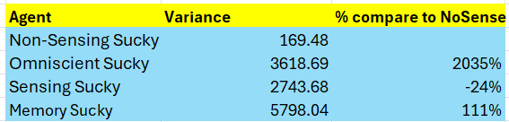

<h1 align="center">Intelligent Agent: For Autonomous Cleaning, Exploration & Hazard Detection</h1>

<b>By: Mustafa Shabbir Bhavanagarwala</b>

## About the Project

This project involves developing, testing and evaluating agents' performance in cleaning dirt,where the agents have to avoid walls while managing battery life. The agents are also trained to get back home once their battery level goes down below a threshold. A* search algorithm is used for the agents to find the most efficient path from an initial state to a goal state in the test bed. A number of features are incorporated in the agents. A signinficant feature incorporated in the agent is that it can be commanded to travel to a place and get back home what is present at that place, for example gold. Optimization tasks such as shortest path planning are partly based on current sensor readings, world models & probabilities. Another interesting feature is the agent is provided the ability to bust an invisible object autonomously and accurately based on pure probabilities. The invisible object can be treated as a ghost. The agent cannot sense the object, and can only move from square to square, and can Probe and Bust. The sensor should be Red if the agent is in the same square as the object, Green if it is far away, and so on. The Bust operation succeeds if the agent performs it while in the same square as the object. Posterior distribution over the object locations are done using Bayes rule. The sense operation has a cost and the bust operation has a larger cost, but Bust results in a reward if it is executed in the square with the object.
 
The project simulates different agent architectures in a 20x20 grid environment.  The environment is configured with different dirt densities, distributions, and wall configurations. Agents can perceive and act within this grid, choosing actions like moving, cleaning, loading, unloading, & busting. The project involves running multiple experiments, gathering data, and comparing agent performance across varying conditions. Intent classification is carried out to implement the conversational agents. 
For the cleaning task, an in depth analysis is done to compare the performance between the four agents. The four agents are as follows:
 
<ul><li>
Non-Sensing Sucky:  the original and most primitive, the agent does not have any sensors</li>
<li>Sensing Sucky:  These agents have no memory, but have the revolutionary Dirt and Bump sensors</li>
<li>Memory Sucky:  These agents can build a simple world model based on their limited sensors</li>
<li>Omniscient Sucky:  Very much a niche product, this agent can get complete information about its environment by having the installed custom sensors at the site
</li></ul>
 
Here the data is gathered by running the candidate agents in the simulation testbed and recording the score. The experiments are run over a range of environmental conditions. Statical analysis is carried out for the comparison of the agents performance. 

<ul><li>
Agents score comparisons in various environments. Percentage improvement comparison with Non Sensing Agent</li></ul>

 
<ul><li>Variance Comparison of the Agents</li></ul>

 
<ul><li>Overall percentage improvement comparison with Non Sensing Agent</li></ul>

 From the overall comparison chart, Omniscient Sucky performs the best followed by Memory Sucky, Sensing Sucky and Non-sensing Sucky.
 
The project has significant use in autonomous home cleaning robots, industrial floor cleaners, & robots used in hazardous environments. The technology used in developing the project is Python.

