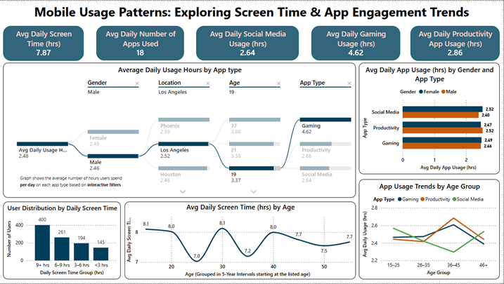
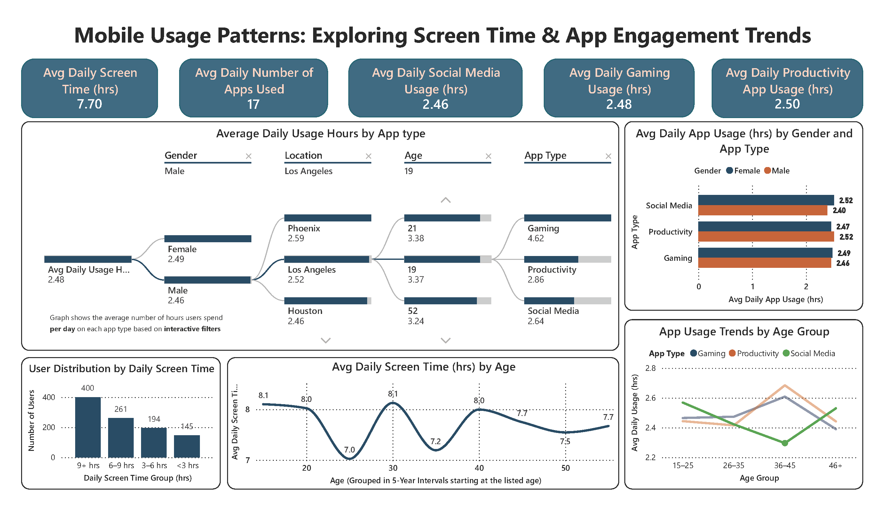
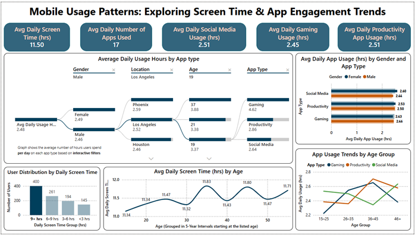

# 📱 Mobile Usage Patterns: Exploring Screen Time & App Engagement Trends

**Author**: Mustafa Shabbir Bhavanagarwala  
**Tools Used**: Power BI, DAX

## 🔍 Overview

This Power BI dashboard project explores behavioral insights into mobile screen time and app usage across demographics. The goal is to identify usage trends, app engagement levels, and behavioral nuances by age, gender, and location.

---

## 🗂️ Dataset Description

**Dataset Name**: `mobile_usage_behavioral_analysis`

It contains mobile usage data of users aged 18–60 from various cities. Key fields include:

- `User_ID`: Unique user identifier
- `Age`, `Gender`, `Location`
- `Total_App_Usage_Hours`, `Daily_Screen_Time_Hours`
- `Number_of_Apps_Used`
- App category usage hours: `Social_Media`, `Productivity`, `Gaming`

### 📊 Engineered Tables in Power BI

<h3>📊 Engineered Tables in Power BI</h3>

<table border="1" cellpadding="6" cellspacing="0">
  <thead>
    <tr>
      <th>Table Name</th>
      <th>Purpose</th>
    </tr>
  </thead>
  <tbody>
    <tr>
      <td>AgeAxis</td>
      <td>Enables continuous age trend visualizations</td>
    </tr>
    <tr>
      <td>AgeBinsTable</td>
      <td>Bins ages into 5-year groups</td>
    </tr>
    <tr>
      <td>GenderLookup</td>
      <td>Consistent gender sort order in charts</td>
    </tr>
    <tr>
      <td>App_Usage_By_Type</td>
      <td>Contains usage aggregations and derived columns</td>
    </tr>
  </tbody>
</table>

---

## 🗂️ Dashboard Overview

### 💡 Interactivity Notes

- **Synchronized visuals**: Filtering one chart affects others unless disabled (seen via the “no impact” icon).  
- **Hover tooltips**: All visuals show precise metrics on hover.  
- **Visual layering and text elements**: Organized using the Power BI Selection Pane for optimal readability.  
 

Kindly open this report: and zoom in for actual Power BI dashboard size view

KINDLY OPEN THIS REPORT AND ZOOM IN FOR ACTUAL POWER BI DASHBOARD SIZE VIEW: [AnalysisReport](Analysis_Report.pdf)

<ul>
<li>Average Daily Usage Hours by App Type</li>
</ul>

 
 

<ul>
<li>User Distribution by Daily Screen Time</li>
</ul>

 
 

<ul>
<li>Average Daily Screen Time (hrs) by Age</li>
</ul>

 
 

<ul>
<li>Average Daily App Usage (hrs) by Gender and App Type</li>
</ul>

 
 

<ul>
<li>App Usage Trends by Age Group</li>
</ul>

 
 

## 📈 Dashboard Structure

### KPI Cards (Quick Summary)

<h3>📌 KPI Summary</h3>

<table border="1" cellpadding="6" cellspacing="0">
  <thead>
    <tr>
      <th>Metric</th>
      <th>Value</th>
    </tr>
  </thead>
  <tbody>
    <tr>
      <td>Avg Daily Screen Time (hrs)</td>
      <td>7.78</td>
    </tr>
    <tr>
      <td>Avg Daily Number of Apps Used</td>
      <td>16</td>
    </tr>
    <tr>
      <td>Avg Daily Social Media Usage (hrs)</td>
      <td>3.58</td>
    </tr>
    <tr>
      <td>Avg Daily Gaming Usage (hrs)</td>
      <td>1.51</td>
    </tr>
    <tr>
      <td>Avg Daily Productivity App Usage (hrs)</td>
      <td>2.11</td>
    </tr>
  </tbody>
</table>

### Main Visuals & Insights

1. **Decomposition Tree**: Drill into usage by Gender → Location → Age → App Type
2. **App Usage by Gender and App Type**:
   - Females slightly lead in Social Media usage
   - Males use Productivity apps marginally more
3. **User Distribution by Screen Time**:
   - Majority use phones 9+ hrs/day
4. **Screen Time by Age**:
   - Peaks at 18, 29, and 39 years
   - Dips during transitional life stages (e.g., 24, 34)
5. **App Usage Trends by Age Group**:
   - Social Media: Most popular among 15–25
   - Productivity & Gaming: Peaks at 36–45

---

## 🧠 Key Insights

- Younger users are more active on social platforms.
- Working-age users dominate Productivity and Gaming categories.
- A large segment of users spend 9+ hours daily on their phones.

---

## 🎯 Applications

- User segmentation for targeted marketing
- App feature development and personalization
- UX research and digital wellness studies

---

## 📌 Project Purpose

To deliver an interactive, insightful dashboard that helps stakeholders understand digital behaviors and usage patterns in a mobile-first world.

---
