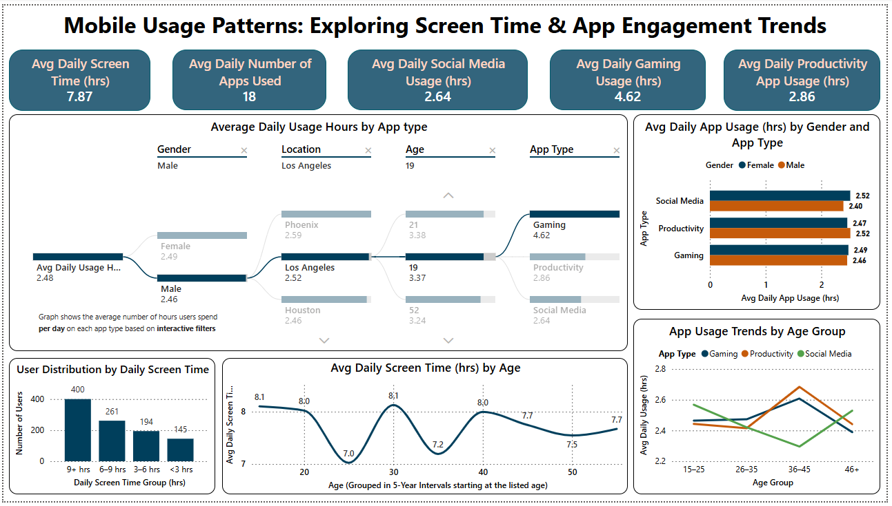
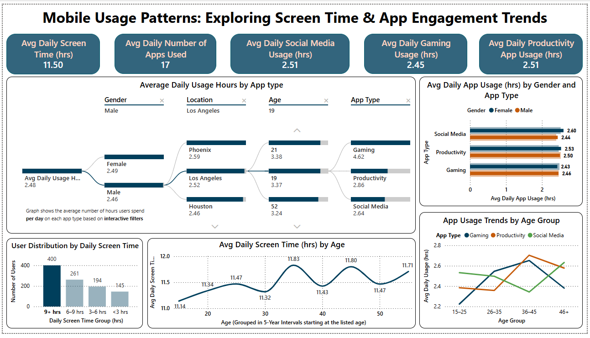
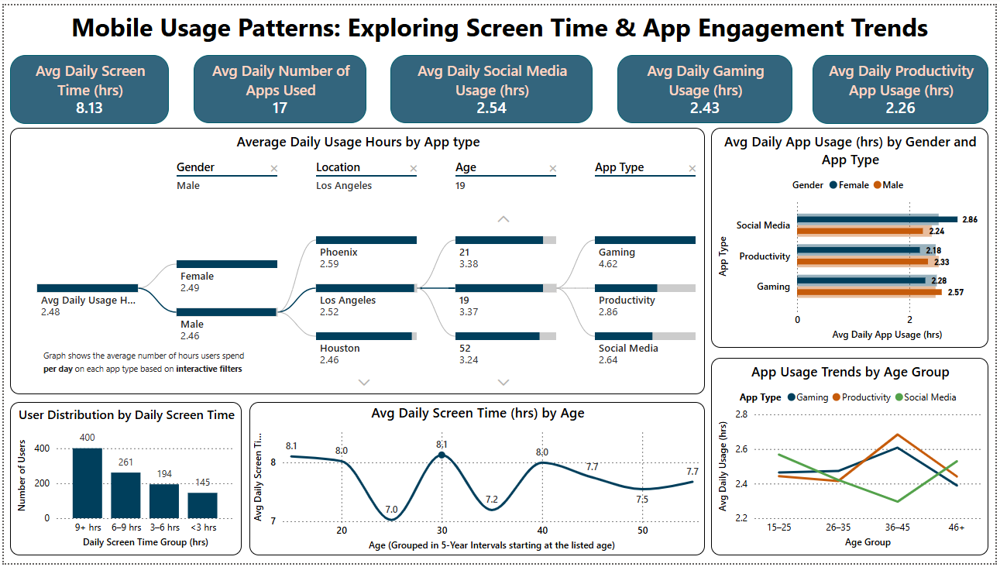
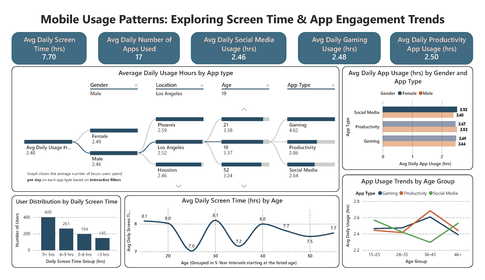
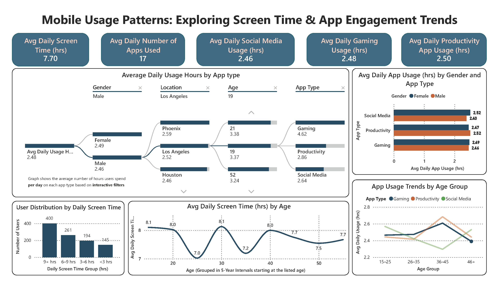
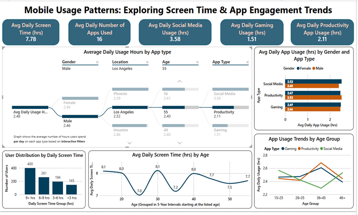

<h1 align="center">Mobile Usage Patterns: Exploring Screen Time & App Engagement Trends</h1>

<b>By: Mustafa Shabbir Bhavanagarwala</b>

## Overview

In this project, the behavioral insights into mobile screen time and app usage across demographics are explored using Power BI. The goal is to identify usage trends, app engagement levels, and behavioral nuances by age, gender, and location.

## Dataset Description

The dataset contains mobile usage data of users aged 18–60 from various cities in the United States. Key fields include:

- `User_ID`: Unique user identifier
- `Age`, `Gender`, `Location`
- `Total_App_Usage_Hours`, `Daily_Screen_Time_Hours`
- `Number_of_Apps_Used`
- App category usage hours: `Social_Media`, `Productivity`, `Gaming`

### Engineered Tables in Power BI

<table border="1" cellpadding="6" cellspacing="0">
  <thead>
    <tr>
      <th>Table Name</th>
      <th>Purpose</th>
    </tr>
  </thead>
  <tbody>
    <tr>
      <td>AgeAxis</td>
      <td>Enables continuous age trend visualizations</td>
    </tr>
    <tr>
      <td>AgeBinsTable</td>
      <td>Bins ages into 5-year groups</td>
    </tr>
    <tr>
      <td>GenderLookup</td>
      <td>Consistent gender sort order in charts</td>
    </tr>
    <tr>
      <td>App_Usage_By_Type</td>
      <td>Contains usage aggregations and derived columns</td>
    </tr>
  </tbody>
</table>

 

## Tools Used
<ul>
<li>Power BI</li>
<li>DAX</li>
</ul>

## Dashboard Overview

### Interactivity Notes

- **Synchronized visuals**: Filtering one chart affects others unless disabled (seen via the “no impact” icon).  
- **Hover tooltips**: All visuals show precise metrics on hover.  
- **Visual layering and text elements**: Organized using the Power BI Selection Pane for optimal readability.  
 

**KINDLY ZOOM IN FOR ACTUAL POWER BI DASHBOARD SIZE VIEW**

<ul>
<li>Focus Graph: Average Daily Usage Hours by App Type</li>
</ul>

 
 

<ul>
<li>Focus Graph: User Distribution by Daily Screen Time</li>
</ul>

 
 

<ul>
<li>Focus Graph: Average Daily Screen Time (hrs) by Age</li>
</ul>

 
 

<ul>
<li>Focus Graph: Average Daily App Usage (hrs) by Gender and App Type</li>
</ul>

 
 

<ul>
<li>Focus Graph: App Usage Trends by Age Group</li>
</ul>

 
 

## Dashboard Structure

### KPI Cards (Quick Summary)

<table border="1" cellpadding="6" cellspacing="0">
  <thead>
    <tr>
      <th>Metric</th>
      <th>Value</th>
    </tr>
  </thead>
  <tbody>
    <tr>
      <td>Avg Daily Screen Time (hrs)</td>
      <td>7.78</td>
    </tr>
    <tr>
      <td>Avg Daily Number of Apps Used</td>
      <td>16</td>
    </tr>
    <tr>
      <td>Avg Daily Social Media Usage (hrs)</td>
      <td>3.58</td>
    </tr>
    <tr>
      <td>Avg Daily Gaming Usage (hrs)</td>
      <td>1.51</td>
    </tr>
    <tr>
      <td>Avg Daily Productivity App Usage (hrs)</td>
      <td>2.11</td>
    </tr>
  </tbody>
</table>

### Insights

Example

 
 

1. **Decomposition Tree: Avg Daily Usage Hours by App Type**

   - **Purpose**: Drill down into usage behavior from overall usage to demographics and app category.
   - **Hierarchy Path**: Gender → Location → Age → App Type
   - **Interaction Example**: Selecting Male users from Los Angeles aged 55:
     - **Social Media**: 3.58 hrs  
     - **Productivity**: 2.11 hrs  
     - **Gaming**: 1.51 hrs  

   This tool facilitates deep exploration of how combinations of demographic variables influence app usage behavior.

2. **Bar Chart: Avg Daily App Usage (hrs) by Gender and App Type**

   - **Purpose**: Compare male vs. female usage by app category.
   - **Insights**:
     - **Social Media**: Females use more (2.52 hrs) than males (2.40 hrs)
     - **Productivity**: Males slightly ahead (2.52 hrs vs. 2.47 hrs)
     - **Gaming**: Near identical (2.49 hrs vs. 2.46 hrs)

   Subtle behavioral differences emerge between genders, particularly in social and productivity apps.

3. **Column Chart: User Distribution by Daily Screen Time**

   - **Purpose**: Show how users are distributed across screen time brackets.
   - **Insights**:
     - Majority of users (400) spend **9+ hours/day**
     - Gradual decline: **6–9 hrs** (261), **3–6 hrs** (194), **<3 hrs** (145)

   This highlights heavy mobile dependency in a large portion of the user base.

4. **Line Chart: Avg Daily Screen Time (hrs) by Age**

   - **Purpose**: Track screen time behavior by age (5-year intervals).
   - **X-axis Note**: Each tick represents the start of a 5-year group (e.g., 20 → ages 20–24)
   - **Insights**:
     - Peaks at **18 (8.1 hrs)**, **29 (8.1 hrs)**, and **39 (8.0 hrs)**
     - Dips at **24 (7.0 hrs)**, **34 (7.2 hrs)**, and **49 (7.5 hrs)**

   Fluctuations reflect life-stage transitions like college, early career, and midlife.

5. **Line Chart: App Usage Trends by Age Group**

   - **Purpose**: Visualize app type preferences across age groups.
   - **Age Bins**: 15–25, 26–35, 36–45, 46+
   - **Insights**:
     - **Social Media**: Most used in the **15–25 group** (~2.55 hrs)
     - **Gaming**: Peaks in the **36–45 group** (~2.6 hrs), not the youngest
     - **Productivity**: Highest in **36–45** (~2.75 hrs), aligning with working professionals

   This reveals surprising patterns—**younger users are more social-media active**, and **mid-aged users lead in productivity and gaming**.

## Key Insights

- Younger users are more active on social platforms.
- Working-age users dominate Productivity and Gaming categories.
- A large segment of users spend 9+ hours daily on their phones.

## Applications

- User segmentation for targeted marketing
- App feature development and personalization
- UX research and digital wellness studies

More information regarding the project can be found here: [Report](Analysis_Report.pdf)

