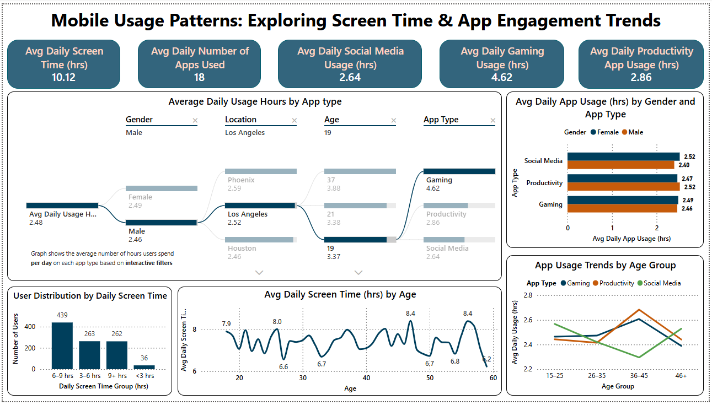
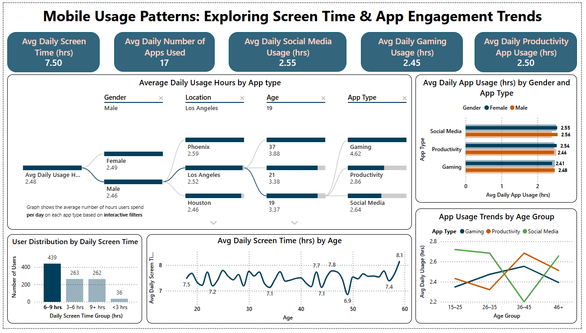
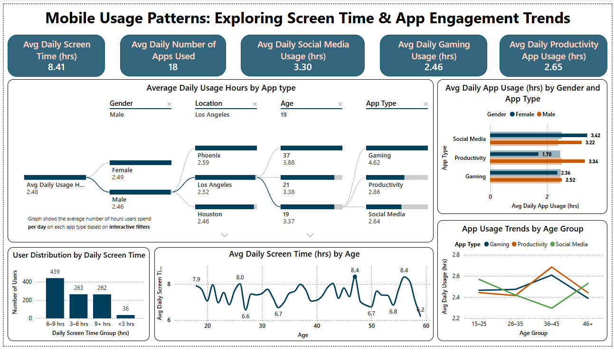
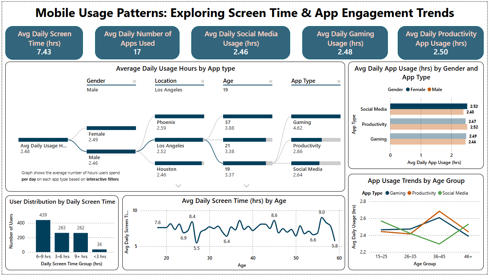
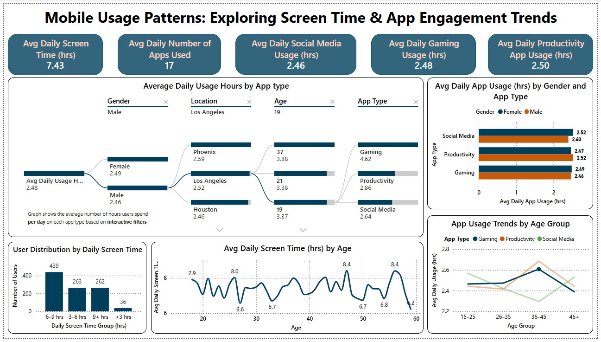
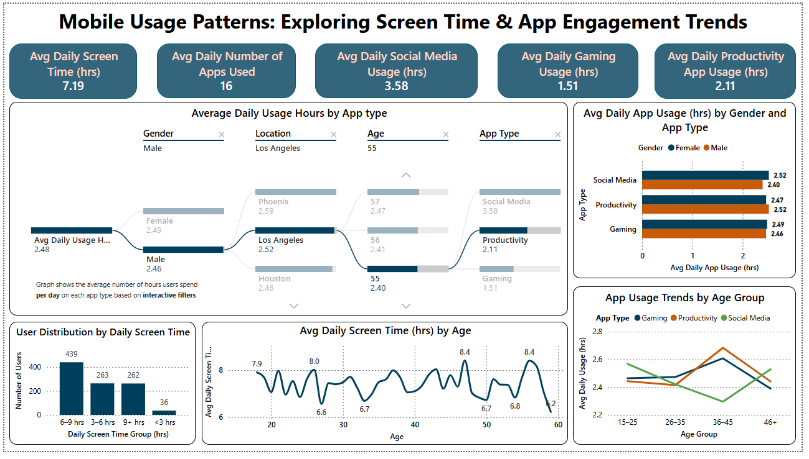

<h1 align="center">Mobile Usage Patterns: Exploring Screen Time & App Engagement Trends</h1>

<b>By: Mustafa Shabbir Bhavanagarwala</b>

## Overview

In this project, the behavioral insights into mobile screen time and app usage across demographics are explored using Power BI. The goal is to identify usage trends, app engagement levels, and behavioral nuances by age, gender, and location.

## Dataset Description

The dataset contains mobile usage data of users aged 18–60 from various cities in the United States. Key fields include:

- `User_ID`: Unique user identifier
- `Age`, `Gender`, `Location`
- `Daily_Screen_Time_Hours`
- `Number_of_Apps_Used`
- App category usage hours: `Social_Media`, `Productivity`, `Gaming`

### Engineered Tables in Power BI

<table border="1" cellpadding="6" cellspacing="0">
  <thead>
    <tr>
      <th>Table Name</th>
      <th>Purpose</th>
    </tr>
  </thead>
  <tbody>
    <tr>
      <td>AgeAxis</td>
      <td>Enables continuous age trend visualizations</td>
    </tr>
    <tr>
      <td>AgeBinsTable</td>
      <td>Bins ages into 5-year groups</td>
    </tr>
    <tr>
      <td>GenderLookup</td>
      <td>Consistent gender sort order in charts</td>
    </tr>
    <tr>
      <td>App_Usage_By_Type</td>
      <td>Contains usage aggregations and derived columns</td>
    </tr>
  </tbody>
</table>

 

## Tools Used
<ul>
<li>Power BI</li>
<li>DAX</li>
</ul>

## Dashboard Overview

### Interactivity Notes

- **Synchronized visuals**: Filtering one chart affects others unless disabled (seen via the “no impact” icon).  
- **Hover tooltips**: All visuals show precise metrics on hover.  
- **Visual layering and text elements**: Organized using the Power BI Selection Pane for optimal readability.  
 

**KINDLY ZOOM IN FOR ACTUAL POWER BI DASHBOARD SIZE VIEW**

<ul>
<li>Focus Graph: Average Daily Usage Hours by App Type</li>
</ul>

 
 

<ul>
<li>Focus Graph: User Distribution by Daily Screen Time</li>
</ul>

 
 

<ul>
<li>Focus Graph: Average Daily Screen Time (hrs) by Age</li>
</ul>

 
 

<ul>
<li>Focus Graph: Average Daily App Usage (hrs) by Gender and App Type</li>
</ul>

 
 

<ul>
<li>Focus Graph: App Usage Trends by Age Group</li>
</ul>

 
 

## Dashboard Structure

### KPI Cards (Quick Summary)

<table border="1" cellpadding="6" cellspacing="0">
  <thead>
    <tr>
      <th>Metric</th>
      <th>Value</th>
    </tr>
  </thead>
  <tbody>
    <tr>
      <td>Avg Daily Screen Time (hrs)</td>
      <td>7.78</td>
    </tr>
    <tr>
      <td>Avg Daily Number of Apps Used</td>
      <td>16</td>
    </tr>
    <tr>
      <td>Avg Daily Social Media Usage (hrs)</td>
      <td>3.58</td>
    </tr>
    <tr>
      <td>Avg Daily Gaming Usage (hrs)</td>
      <td>1.51</td>
    </tr>
    <tr>
      <td>Avg Daily Productivity App Usage (hrs)</td>
      <td>2.11</td>
    </tr>
  </tbody>
</table>

### Insights

Example

 
 

1. **Decomposition Tree: Avg Daily Usage Hours by App Type**

   - **Purpose**: Drill down into average daily app usage from an overall level to specific demographics.
   - **Hierarchy Path**: Gender → Location → Age → App Type
   - **Interaction Example**: Selecting Male users from Los Angeles aged 55:
     - **Social Media**: 3.58 hrs  
     - **Productivity**: 2.11 hrs  
     - **Gaming**: 1.51 hrs  
   - **Key Insight**: The selected user segment group spends the most time on Social Media, followed by Productivity apps, with the least on Gaming.

2. **Bar Chart: Avg Daily App Usage (hrs) by Gender and App Type**

   - **Purpose**: Compare male vs. female app usage across categories.
   - **Insights**:
     - **Social Media**: Females (2.52 hrs) > Males (2.40 hrs)  
     - **Productivity**: Males (2.52 hrs) > Females (2.47 hrs)  
     - **Gaming**: Females (2.49 hrs) > Males (2.46 hrs)  
   - **Key Insight**: Across all categories, the differences between genders are very small (all under 0.1 hrs). While females lead slightly in Social Media and Gaming, males use Productivity apps just a bit more.

3. **Histogram: User Distribution by Daily Screen Time**

   - **Purpose**: Display how users are spread across screen time brackets.
   - **Insights**:
     - **6–9 hrs/day**: Largest group (439 users)  
     - **3–6 hrs/day**: 263 users  
     - **9+ hrs/day**: 262 users  
     - **<3 hrs/day**: Only 36 users  
   - **Key Insight**: Most users (71%) spend more than 6 hours daily on screens, indicating high overall screen dependency.

4. **Line Chart: Avg Daily Screen Time (hrs) by Age**

   - **Purpose**: Show variation in average screen time across different ages.
   - **Insights**:
     - **Peaks** at Age 18 (7.9 hrs), 26 (8.0 hrs), 47 (8.4 hrs), 56 (8.4 hrs)  
     - **Lows** at Age 27 (~6.6 hrs), 33 (~6.7 hrs), 50 (~6.7 hrs), 59 (~6.23 hrs)  
   - **Key Insight**: Screen time fluctuates significantly across ages, with notable peaks in early adulthood (18, 26) and late 40s to mid-50s (47, 56). The lowest engagement occurs in late 20s to early 30s and again near retirement age, suggesting varying digital behavior likely driven by lifestyle and work-life balance changes at different life stages.

5. **Line Chart: App Usage Trends by Age Group**

   - **Purpose**: Compare usage of app categories across age ranges.
   - **Insights**:
     - **Social Media**: Highest in 15–25 group, declines steadily with age and rises from 36–45 group  
     - **Productivity**: Peaks in 36–45 group (~2.7 hrs), lowest in 26–35  
     - **Gaming**: Fairly flat, slightly higher in 36–45 group, minor drop after  
   - **Key Insight**:
     - Younger users prefer **Social Media and Gaming**  
     - Middle-aged users (36–45) are most engaged in **Productivity apps**  
     - This reflects shifting digital priorities with age.

6. **KPI Tiles: Summary Metrics**

   - **Avg Daily Screen Time**: 7.19 hrs  
   - **Avg Daily Number of Apps Used**: 16  
   - **Avg Daily Social Media Usage**: 3.58 hrs  
   - **Avg Daily Gaming Usage**: 1.51 hrs  
   - **Avg Daily Productivity App Usage**: 2.11 hrs  
   - **Key Insight**: Users spend half of their screen time on Social Media, and use a broad variety of apps (16 daily).

## Applications

- User segmentation for targeted marketing
- App feature development and personalization
- UX research and digital wellness studies

More information regarding the project can be found here: [Report](Analysis_Report.pdf)

