# United Airines(UA) Advanced Analysis Based On departure delays

2024-10-04

``` r
library(tidyverse)
```

```         
## ── Attaching core tidyverse packages ──────────────────────── tidyverse 2.0.0 ──
## ✔ dplyr     1.1.4     ✔ readr     2.1.5
## ✔ forcats   1.0.0     ✔ stringr   1.5.1
## ✔ ggplot2   3.5.1     ✔ tibble    3.2.1
## ✔ lubridate 1.9.3     ✔ tidyr     1.3.1
## ✔ purrr     1.0.2     
## ── Conflicts ────────────────────────────────────────── tidyverse_conflicts() ──
## ✖ dplyr::filter() masks stats::filter()
## ✖ dplyr::lag()    masks stats::lag()
## ℹ Use the conflicted package (<http://conflicted.r-lib.org/>) to force all conflicts to become errors
```

``` r
library(nycflights13)
UAf <- flights %>%
  filter(carrier=="UA")
UAf <- UAf %>%
  filter(!is.na(dep_delay))

m1 <-merge(flights, weather, flights = c("origin", "time_hour","hour"), by.weather = c("origin", "time_hour","hour"), all.x = FALSE, all.y = FALSE, sort = TRUE)
m2 <- m1 %>%
  filter(carrier=="UA")
maindf <- m2 %>%
  filter(!is.na(dep_delay)) %>%
  select(dep_time,year,month,day,dep_time,dep_delay,carrier,time_hour,hour,temp,wind_speed,precip,visib)
```

``` r
ggplot(data = maindf, mapping = aes(x = hour)) +
  geom_histogram(bins = 24, color = "black", fill = "green") +
  ggtitle("Time of Day")
```

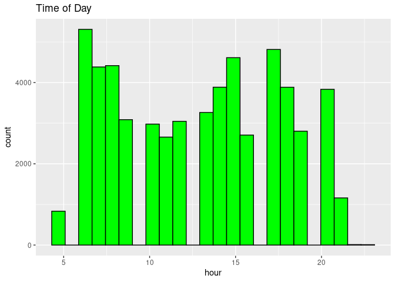<!-- -->

``` r
ggplot(data = maindf, aes(x = hour, y =dep_delay ))+
  geom_point()
```

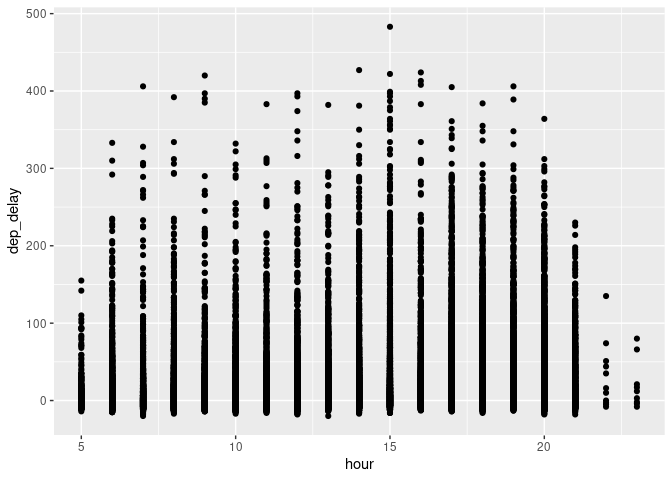<!-- -->

``` r
avg_delay_by_hour <- maindf %>%
  group_by(hour) %>%
  summarize(avg_delay = mean(dep_delay, na.rm = TRUE))

# Create the line plot
ggplot(avg_delay_by_hour, aes(x = hour, y = avg_delay)) +
  geom_line(color = "blue") +
  geom_point(color = "red") +  
  labs(title = "Average Departure Delay by Hour ",
       x = "Hour",
       y = "Average Departure Delay") +
  theme_minimal()
```

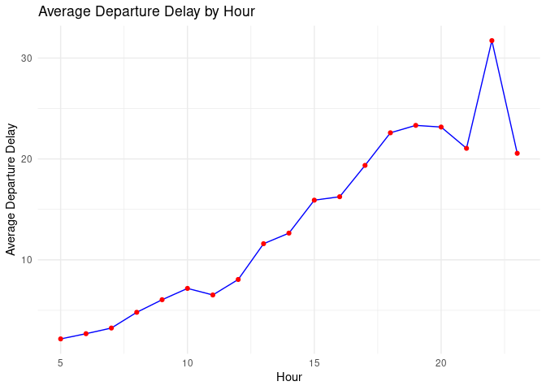<!-- -->

``` r
ggplot(data = maindf, mapping = aes(x = month)) +
  geom_histogram(color = "black", fill = "green") +
  ggtitle("Time of Year")
```

```         
## `stat_bin()` using `bins = 30`. Pick better value with `binwidth`.
```

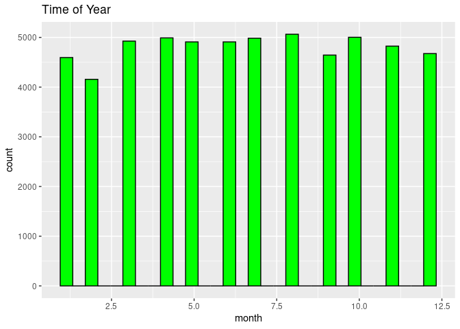<!-- -->

``` r
ggplot(data = maindf, aes(x = month, y =dep_delay ))+
  geom_point()
```

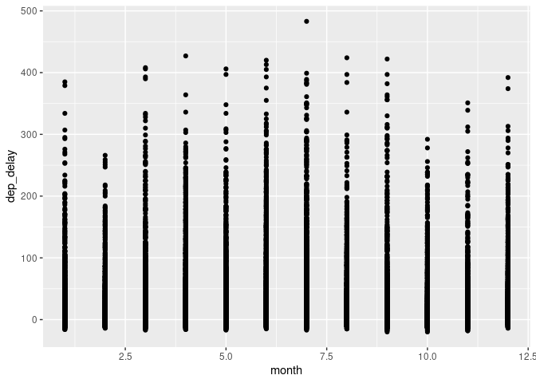<!-- -->

``` r
ggplot(maindf, aes(x = factor(month), y = dep_delay)) +
  geom_boxplot(fill = "skyblue", color = "darkblue") +
  labs(title = "Departure Delay by Month",
       x = "Month",
       y = "Departure Delay ") +
  scale_x_discrete(labels = month.abb) +  
  theme_minimal()
```

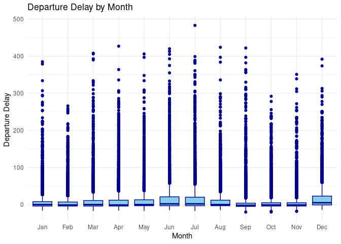<!-- -->

``` r
ggplot(data = maindf, aes(x = temp, y =dep_delay ))+
  geom_point()
```

```         
## Warning: Removed 7 rows containing missing values or values outside the scale range
## (`geom_point()`).
```

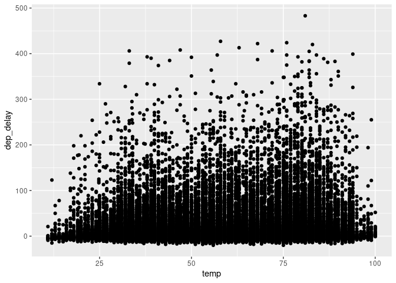<!-- -->

``` r
avg_delay_by_temp <- maindf %>%
  mutate(temp_rounded = round(temp)) %>%
  group_by(temp_rounded) %>%
  summarize(avg_delay = mean(dep_delay, na.rm = TRUE))

# Create the line plot
ggplot(avg_delay_by_temp, aes(x = temp_rounded, y = avg_delay)) +
  geom_line(color = "blue") +
  geom_point(color = "red") + 
  labs(title = "Average Departure Delay by Temperature",
       x = "Temperature",
       y = "Average Departure Delay ") +
  theme_minimal()
```

```         
## Warning: Removed 1 row containing missing values or values outside the scale range
## (`geom_line()`).

## Warning: Removed 1 row containing missing values or values outside the scale range
## (`geom_point()`).
```

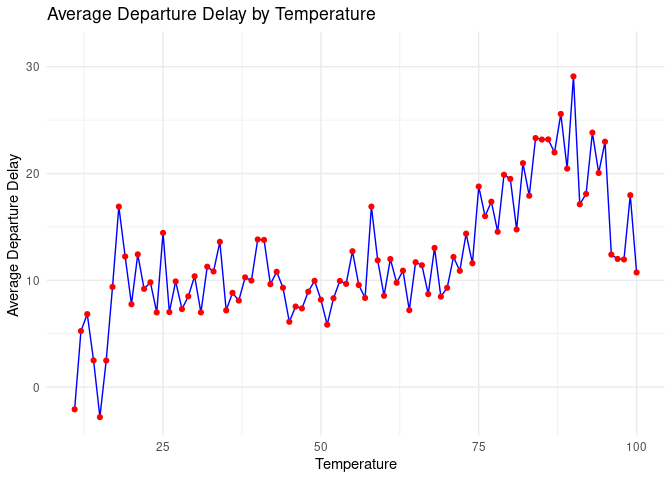<!-- -->

``` r
ggplot(data = maindf, mapping = aes(x = wind_speed)) +
  geom_histogram(color="black", fill="red") +
  ggtitle("WindSpeed")
```

```         
## `stat_bin()` using `bins = 30`. Pick better value with `binwidth`.

## Warning: Removed 17 rows containing non-finite outside the scale range
## (`stat_bin()`).
```

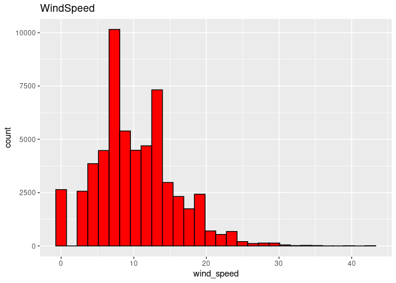<!-- -->

``` r
avg_delay_by_wind <- maindf %>%
  mutate(wind_speed_rounded = round(wind_speed)) %>%
  group_by(wind_speed_rounded) %>%
  summarize(avg_delay = mean(dep_delay, na.rm = TRUE))

# Create the line plot
ggplot(avg_delay_by_wind, aes(x = wind_speed_rounded, y = avg_delay)) +
  geom_line(color = "blue") +
  geom_point(color = "red") + 
  labs(title = "Average Departure Delay by Wind Speed",
       x = "Wind Speed ",
       y = "Average Departure Delay ") +
  theme_minimal()
```

```         
## Warning: Removed 1 row containing missing values or values outside the scale range
## (`geom_line()`).

## Warning: Removed 1 row containing missing values or values outside the scale range
## (`geom_point()`).
```

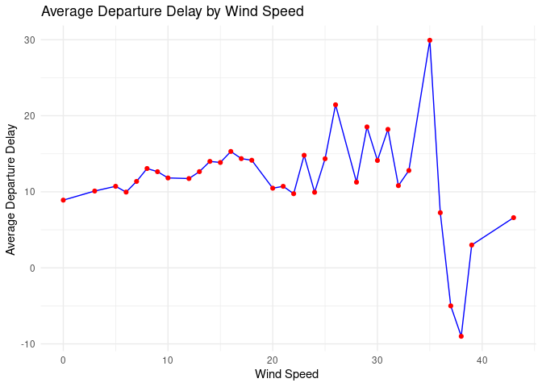<!-- -->

``` r
ggplot(data = maindf, aes(x = wind_speed, y =dep_delay ))+
  geom_point()
```

```         
## Warning: Removed 17 rows containing missing values or values outside the scale range
## (`geom_point()`).
```

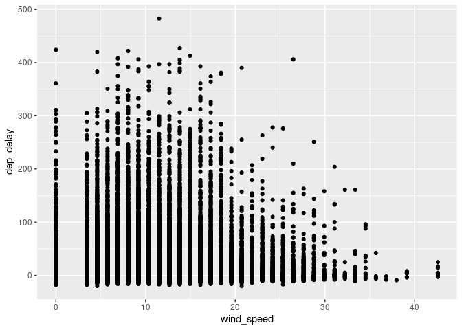<!-- -->

``` r
ggplot(data = maindf, mapping = aes(x = precip)) +
  geom_histogram(color="black", fill="green") +
  ggtitle("Precipitation")
```

```         
## `stat_bin()` using `bins = 30`. Pick better value with `binwidth`.
```

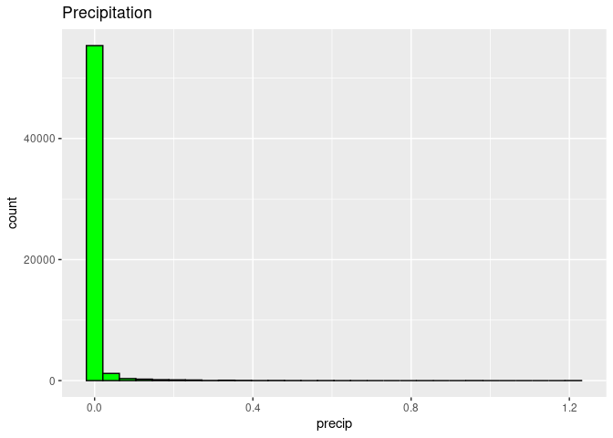<!-- -->

``` r
ggplot(data = maindf, aes(x = precip, y =dep_delay ))+
  geom_point()
```

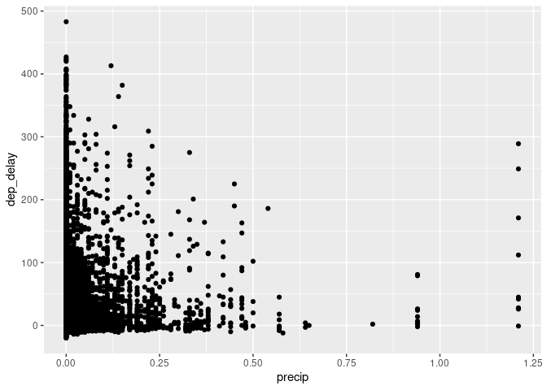<!-- -->

``` r
flights_data <- maindf %>%
  mutate(precip_category = cut(precip,
                               breaks = c(-Inf, 0, 5, 15, Inf),
                               labels = c("None", "Low", "Medium", "High")))

# Create the boxplot
ggplot(flights_data, aes(x = precip_category, y = dep_delay)) +
  geom_boxplot(fill = "lightblue", color = "darkblue") +
  labs(title = "Departure Delay by Precipitation Category",
       x = "Precipitation Level",
       y = "Departure Delay ") +
  theme_minimal()
```

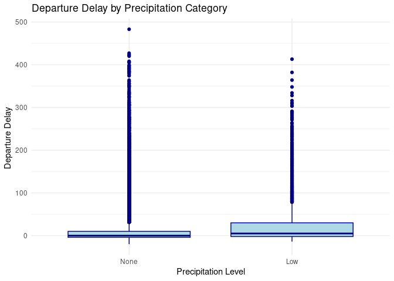<!-- -->

``` r
ggplot(data = maindf, mapping = aes(x = visib)) +
  geom_histogram(color="black", fill="red") +
  ggtitle("Visibility")
```

```         
## `stat_bin()` using `bins = 30`. Pick better value with `binwidth`.
```

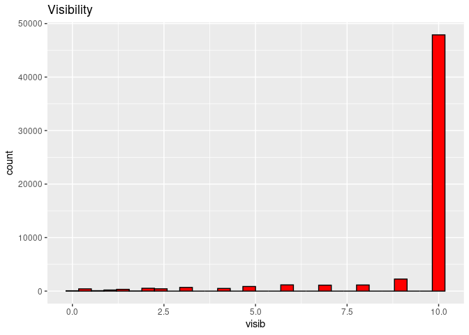<!-- -->

``` r
ggplot(data = maindf, aes(x = visib, y =dep_delay ))+
  geom_point()
```

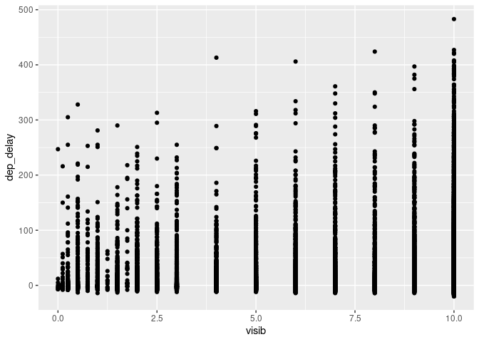<!-- -->

``` r
avg_delay_by_visibility <- maindf %>%
  mutate(visibility_rounded = round(visib)) %>%
  group_by(visibility_rounded) %>%
  summarize(avg_delay = mean(dep_delay, na.rm = TRUE))

# Create the line plot
ggplot(avg_delay_by_visibility, aes(x = visibility_rounded, y = avg_delay)) +
  geom_line(color = "blue") +
  geom_point(color = "red") +  
  labs(title = "Average Departure Delay by Visibility",
       x = "Visibility ",
       y = "Average Departure Delay ") +
  theme_minimal()
```

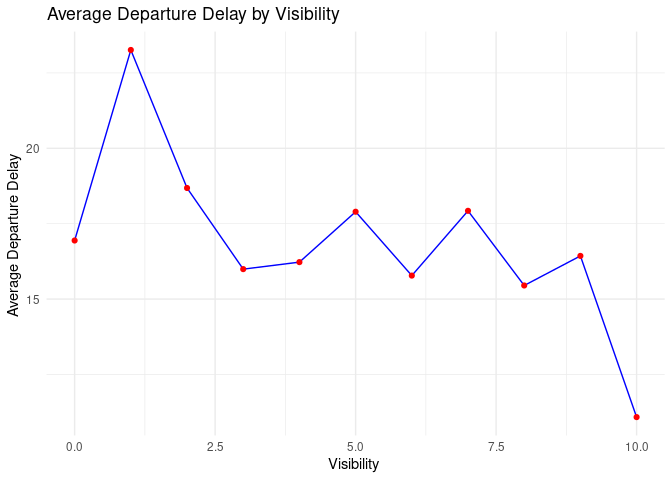<!-- -->

``` r
maindf <- maindf %>%
  mutate(time_of_day = case_when(
    between(hour, 5, 11) ~ 1,
    between(hour, 12, 17) ~ 2,
    TRUE ~ 3))
N<- 10^4-1
observed <- mean(maindf$dep_delay[maindf$time_of_day == 2], na.rm =TRUE)-mean(maindf$dep_delay[maindf$time_of_day == 1], na.rm = TRUE)
result <- numeric(N)
md<-maindf %>% 
  filter(time_of_day == 1)
for (i in 1:N)
{
  index <- sample(nrow(maindf), size=nrow(md),replace = FALSE)
  result[i] <- mean(maindf$dep_delay[index], na.rm = TRUE) -mean(maindf$dep_delay[-index], na.rm = TRUE)
}
ggplot(data = tibble(result), mapping = aes(x = result)) +
  geom_histogram() +
  geom_vline(xintercept = observed, color = "green")
```

```         
## `stat_bin()` using `bins = 30`. Pick better value with `binwidth`.
```

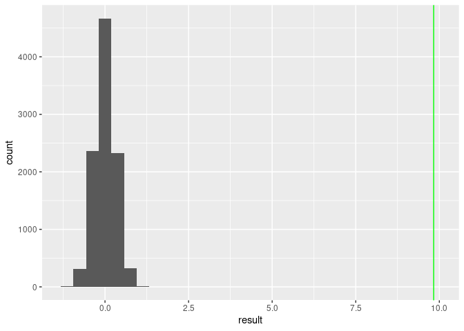<!-- -->

``` r
2 * ((sum(result >= observed) + 1) / (N + 1))
```

```         
## [1] 2e-04
```

``` r
N<- 10^4-1
observed <- mean(maindf$dep_delay[maindf$time_of_day == 3], na.rm =TRUE)-mean(maindf$dep_delay[maindf$time_of_day == 2], na.rm = TRUE)
result <- numeric(N)
mdt<-maindf %>% 
  filter(time_of_day == 2)
for (i in 1:N)
{
  index1 <- sample(nrow(maindf), size=nrow(mdt),replace = FALSE)
  result[i] <- mean(maindf$dep_delay[index1], na.rm = TRUE) -mean(maindf$dep_delay[-index1], na.rm = TRUE)
}
ggplot(data = tibble(result), mapping = aes(x = result)) +
  geom_histogram() +
  geom_vline(xintercept = observed, color = "green")
```

```         
## `stat_bin()` using `bins = 30`. Pick better value with `binwidth`.
```

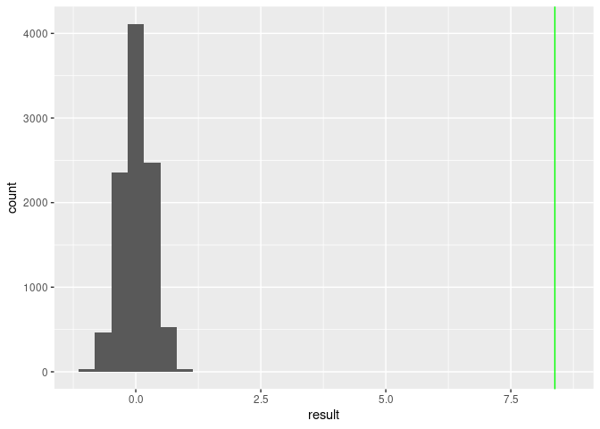<!-- -->

``` r
2 * ((sum(result >= observed) + 1) / (N + 1))
```

```         
## [1] 2e-04
```

``` r
N<- 10^4-1
observedl <- mean(maindf$dep_delay[maindf$time_of_day == 3], na.rm =TRUE)-mean(maindf$dep_delay[maindf$time_of_day == 1], na.rm = TRUE)
resultl <- numeric(N)
mdt1<-maindf %>% 
  filter(time_of_day == 1)
for (i in 1:N)
{
  index2 <- sample(nrow(maindf), size=nrow(mdt1),replace = FALSE)
  resultl[i] <- mean(maindf$dep_delay[index2], na.rm = TRUE) -mean(maindf$dep_delay[-index2], na.rm = TRUE)
}
ggplot(data = tibble(resultl), mapping = aes(x = resultl)) +
  geom_histogram() +
  geom_vline(xintercept = observedl, color = "red")
```

```         
## `stat_bin()` using `bins = 30`. Pick better value with `binwidth`.
```

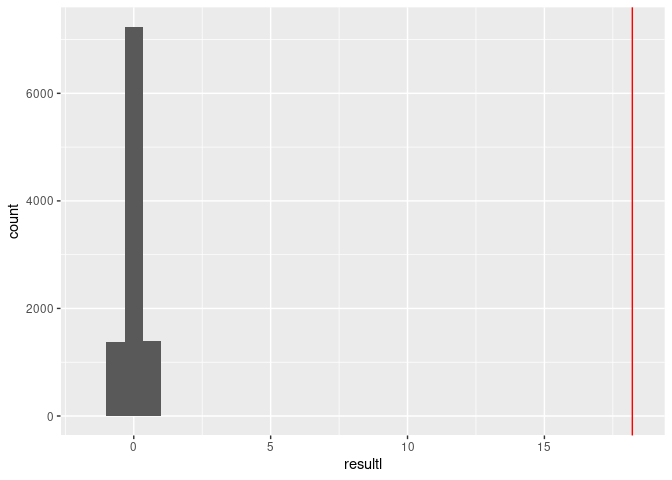<!-- -->

``` r
2 * ((sum(resultl >= observedl) + 1) / (N + 1))
```

```         
## [1] 2e-04
```

``` r
maindf <- maindf %>%
  mutate(Seasons = case_when(
    between(maindf$month, 1, 2) ~ "Wi",
    between(maindf$month, 3, 5) ~ "Sp",
    between(maindf$month, 6, 8) ~ "Su",
    between(maindf$month, 8, 12) ~ "Au",
    TRUE ~ "NA"))
N<- 10^5-1
observedu <- mean(maindf$dep_delay[maindf$Seasons == 'Sp'], na.rm =TRUE)-mean(maindf$dep_delay[maindf$Seasons == 'Wi'], na.rm = TRUE)
resultu <- numeric(N)
sample.size= length(maindf$Seasons)
group.1.size = nrow(tibble(maindf$dep_delay[maindf$Seasons == "Wi"]))
for (i in 1:N)
{
  indexNew <- sample(sample.size, size= group.1.size, replace = FALSE)
  resultu[i] <- mean(maindf$dep_delay[indexNew], na.rm = TRUE) -mean(maindf$dep_delay[-indexNew], na.rm = TRUE)
}
ggplot(data = tibble(resultu), mapping = aes(x = resultu)) +
  geom_histogram() +
  geom_vline(xintercept = observedu, color = "red")
```

```         
## `stat_bin()` using `bins = 30`. Pick better value with `binwidth`.
```

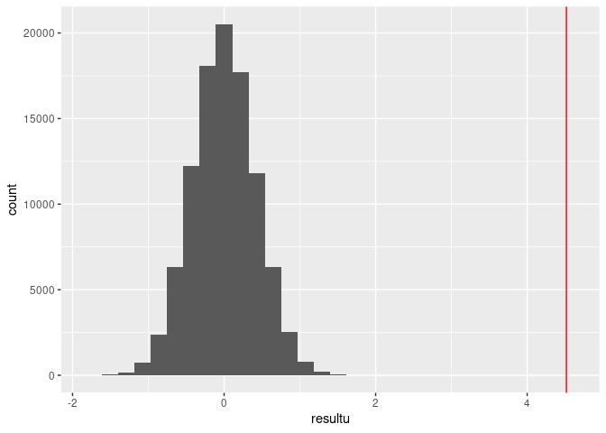<!-- -->

``` r
2 * ((sum(resultu >= observedu) + 1) / (N + 1))
```

```         
## [1] 2e-05
```

``` r
N<- 10^5-1
observedu1 <- mean(maindf$dep_delay[maindf$Seasons == 'Su'], na.rm=TRUE)-mean(maindf$dep_delay[maindf$Seasons == 'Wi'], na.rm = TRUE)
resultu2 <- numeric(N)
sample.size= length(maindf$Seasons)
group.1.size = nrow(tibble(maindf$dep_delay[maindf$Seasons == "Wi"]))
for (i in 1:N)
{
  indexNew1 <- sample(sample.size, size= group.1.size, replace = FALSE)
  resultu2[i] <- mean(maindf$dep_delay[indexNew1], na.rm = TRUE) -mean(maindf$dep_delay[-indexNew1], na.rm = TRUE)
}
ggplot(data = tibble(resultu2), mapping = aes(x = resultu2)) +
  geom_histogram() +
  geom_vline(xintercept = observedu1, color = "red")
```

```         
## `stat_bin()` using `bins = 30`. Pick better value with `binwidth`.
```

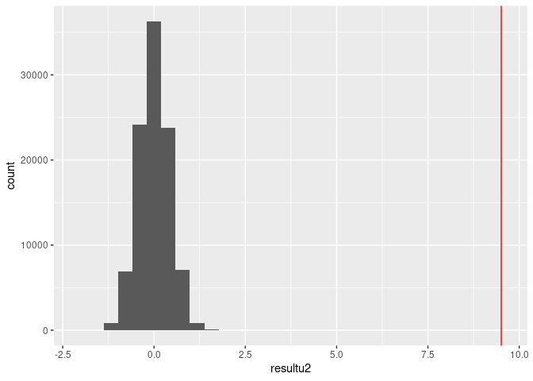<!-- -->

``` r
2 * ((sum(resultu2 >= observedu1) + 1) / (N + 1))
```

```         
## [1] 2e-05
```

``` r
N<- 10^5-1
observedu2 <- mean(maindf$dep_delay[maindf$Seasons == 'Au'], na.rm =TRUE)-mean(maindf$dep_delay[maindf$Seasons == 'Wi'], na.rm = TRUE)
resultu3 <- numeric(N)
sample.size= length(maindf$Seasons)
group.1.size = nrow(tibble(maindf$dep_delay[maindf$Seasons == "Wi"]))
for (i in 1:N)
{
  indexNew2 <- sample(sample.size, size= group.1.size, replace = FALSE)
  resultu3[i] <- mean(maindf$dep_delay[indexNew2], na.rm = TRUE) -mean(maindf$dep_delay[-indexNew2], na.rm = TRUE)
}
ggplot(data = tibble(resultu3), mapping = aes(x = resultu3)) +
  geom_histogram() +
  geom_vline(xintercept = observedu2, color = "red")
```

```         
## `stat_bin()` using `bins = 30`. Pick better value with `binwidth`.
```

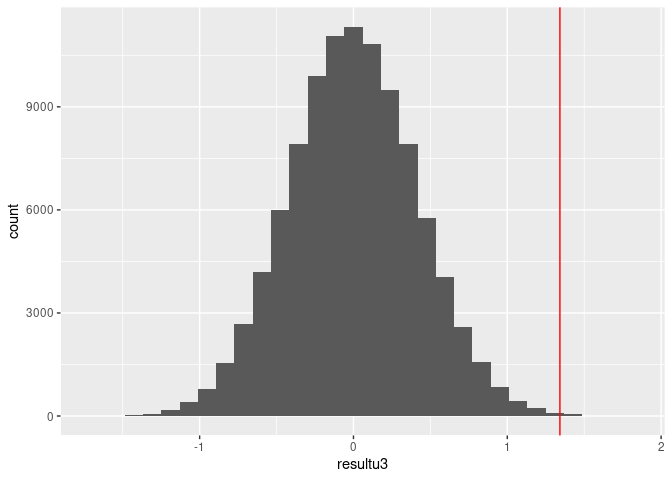<!-- -->

``` r
2 * ((sum(resultu3 >= observedu2) + 1) / (N + 1))
```

```         
## [1] 0.0016
```

``` r
N<- 10^5-1
observedu3 <- mean(maindf$dep_delay[maindf$Seasons == 'Su'], na.rm =TRUE)-mean(maindf$dep_delay[maindf$Seasons == 'Sp'], na.rm = TRUE)
resultu4 <- numeric(N)
sample.size= length(maindf$Seasons)
group.1.size = nrow(tibble(maindf$dep_delay[maindf$Seasons == "Sp"]))
for (i in 1:N)
{
  indexNew3 <- sample(sample.size, size= group.1.size, replace = FALSE)
  resultu4[i] <- mean(maindf$dep_delay[indexNew3], na.rm = TRUE) -mean(maindf$dep_delay[-indexNew3], na.rm = TRUE)
}
ggplot(data = tibble(resultu4), mapping = aes(x = resultu4)) +
  geom_histogram() +
  geom_vline(xintercept = observedu3, color = "red")
```

```         
## `stat_bin()` using `bins = 30`. Pick better value with `binwidth`.
```

<!-- -->

``` r
2 * ((sum(resultu4 >= observedu3) + 1) / (N + 1))
```

```         
## [1] 2e-05
```

``` r
N<- 10^5-1
observedu4 <- mean(maindf$dep_delay[maindf$Seasons == 'Sp'], na.rm =TRUE)-mean(maindf$dep_delay[maindf$Seasons == 'Au'], na.rm = TRUE)
resultu5 <- numeric(N)
sample.size= length(maindf$Seasons)
group.1.size = nrow(tibble(maindf$dep_delay[maindf$Seasons == "Sp"]))
for (i in 1:N)
{
  indexNew4 <- sample(sample.size, size= group.1.size, replace = FALSE)
  resultu5[i] <- mean(maindf$dep_delay[indexNew4], na.rm = TRUE) -mean(maindf$dep_delay[-indexNew4], na.rm = TRUE)
}
ggplot(data = tibble(resultu5), mapping = aes(x = resultu5)) +
  geom_histogram() +
  geom_vline(xintercept = observedu4, color = "red")
```

```         
## `stat_bin()` using `bins = 30`. Pick better value with `binwidth`.
```

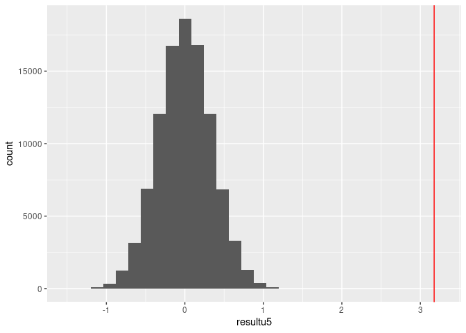<!-- -->

``` r
2 * ((sum(resultu5 >= observedu4) + 1) / (N + 1))
```

```         
## [1] 2e-05
```

``` r
N<- 10^5-1
observedu5 <- mean(maindf$dep_delay[maindf$Seasons == 'Su'], na.rm =TRUE)-mean(maindf$dep_delay[maindf$Seasons == 'Au'], na.rm = TRUE)
resultu6 <- numeric(N)
sample.size= length(maindf$Seasons)
group.1.size = nrow(tibble(maindf$dep_delay[maindf$Seasons == "Su"]))
for (i in 1:N)
{
  indexNew5 <- sample(sample.size, size= group.1.size, replace = FALSE)
  resultu6[i] <- mean(maindf$dep_delay[indexNew5], na.rm = TRUE) -mean(maindf$dep_delay[-indexNew5], na.rm = TRUE)
}
ggplot(data = tibble(resultu6), mapping = aes(x = resultu6)) +
  geom_histogram() +
  geom_vline(xintercept = observedu5, color = "red")
```

```         
## `stat_bin()` using `bins = 30`. Pick better value with `binwidth`.
```

<!-- -->

``` r
2 * ((sum(resultu6 >= observedu5) + 1) / (N + 1))
```

```         
## [1] 2e-05
```

``` r
maindf <- maindf %>%
  mutate(tempNew = case_when(
    between(temp, 0 , 58) ~ 0,
    TRUE ~ 1))
N<- 10^4-1
observedy <- mean(maindf$dep_delay[maindf$tempNew == 1], na.rm =TRUE)-mean(maindf$dep_delay[maindf$tempNew == 0], na.rm = TRUE)
resulty <- numeric(N)
for (i in 1:N)
{
  index3 <- sample(nrow(maindf), size=nrow(maindf %>% filter(tempNew == 1)),replace = FALSE)
  resulty[i] <- mean(maindf$dep_delay[index3], na.rm = TRUE) -mean(maindf$dep_delay[-index3], na.rm = TRUE)
}
ggplot(data = tibble(resulty), mapping = aes(x = resulty)) +
  geom_histogram() +
  geom_vline(xintercept = observedy, color = "red")
```

```         
## `stat_bin()` using `bins = 30`. Pick better value with `binwidth`.
```

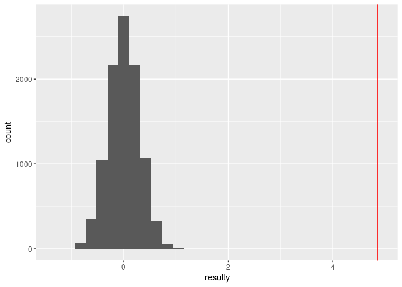<!-- -->

``` r
2 * ((sum(resulty >= observedy) + 1) / (N + 1))
```

```         
## [1] 2e-04
```

``` r
mean_windSpeed <- maindf %>%
  filter(!is.na(wind_speed)) %>%
  summarise(mean_windSpeed = mean(wind_speed))
mean_windSpeed
```

```         
##   mean_windSpeed
## 1       10.31242
```

``` r
maindf <- maindf %>%
  mutate(WindNew = case_when(
    between(wind_speed, 0 , 10.31242) ~ 0,
    TRUE ~ 1))

N<- 10^4-1
observedi <- mean(maindf$dep_delay[maindf$WindNew == 1], na.rm =TRUE)-mean(maindf$dep_delay[maindf$WindNew == 0], na.rm = TRUE)
resulti <- numeric(N)
for (i in 1:N)
{
  index4 <- sample(nrow(maindf), size=nrow(maindf %>% filter(WindNew == 1)),replace = FALSE)
  resulti[i] <- mean(maindf$dep_delay[index4], na.rm = TRUE) -mean(maindf$dep_delay[-index4], na.rm = TRUE)
}
ggplot(data = tibble(resulti), mapping = aes(x = resulti)) +
  geom_histogram() +
  geom_vline(xintercept = observedi, color = "red")
```

```         
## `stat_bin()` using `bins = 30`. Pick better value with `binwidth`.
```

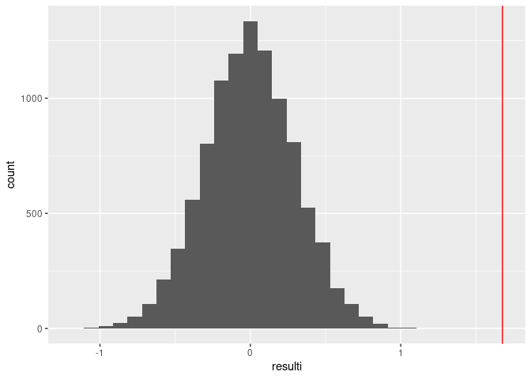<!-- -->

``` r
2 * ((sum(resulti >= observedi) + 1) / (N + 1))
```

```         
## [1] 2e-04
```

``` r
mean_Precip <- maindf %>%
  filter(!is.na(precip)) %>%
  summarise(mean_Precip = mean(precip))

mean_Precip
```

```         
##   mean_Precip
## 1 0.005091357
```

``` r
maindf <- maindf %>%
  mutate(PrecipNew = case_when(
  between(precip, 0 , 0.005091357) ~ 0,
  TRUE ~ 1))

N<- 10^4-1
observedq <- mean(maindf$dep_delay[maindf$PrecipNew == 1], na.rm =TRUE)-mean(maindf$dep_delay[maindf$PrecipNew == 0], na.rm = TRUE)
resultq <- numeric(N)
for (i in 1:N)
{
  index5 <- sample(nrow(maindf), size=nrow(maindf %>% filter(PrecipNew == 1)),replace = FALSE)
  resultq[i] <- mean(maindf$dep_delay[index5], na.rm = TRUE) -mean(maindf$dep_delay[-index5], na.rm = TRUE)
}
ggplot(data = tibble(resultq), mapping = aes(x = resultq)) +
  geom_histogram() +
  geom_vline(xintercept = observedq, color = "red")
```

```         
## `stat_bin()` using `bins = 30`. Pick better value with `binwidth`.
```

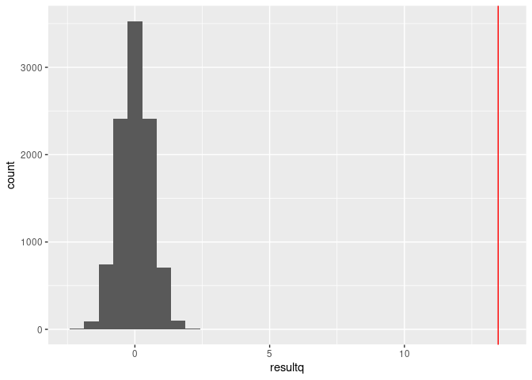<!-- -->

``` r
2 * ((sum(resultq >= observedq) + 1) / (N + 1))
```

```         
## [1] 2e-04
```

``` r
mean_Visib <- maindf %>%
  filter(!is.na(visib)) %>%
  summarise(mean_Visib = mean(visib))

mean_Visib
```

```         
##   mean_Visib
## 1   9.266209
```

``` r
maindf <- maindf %>%
  mutate(VisibNew = case_when(
    between(visib, 0 , 9.266209  ) ~ 0,
    TRUE ~ 1))

N<- 10^4-1
observedg <- mean(maindf$dep_delay[maindf$VisibNew == 0], na.rm =TRUE)-mean(maindf$dep_delay[maindf$VisibNew == 1], na.rm = TRUE)
resultg <- numeric(N)
for (i in 1:N)
{
  index6 <- sample(nrow(maindf), size=nrow(maindf %>% filter(VisibNew == 1)),replace = FALSE)
  resultg[i] <- mean(maindf$dep_delay[index6], na.rm = TRUE) -mean(maindf$dep_delay[-index6], na.rm = TRUE)
}
ggplot(data = tibble(resultg), mapping = aes(x = resultg)) +
  geom_histogram() +
  geom_vline(xintercept = observedg, color = "red")
```

```         
## `stat_bin()` using `bins = 30`. Pick better value with `binwidth`.
```

<!-- -->

``` r
2 * ((sum(resultg >= observedg) + 1) / (N + 1))
```

```         
## [1] 2e-04
```
