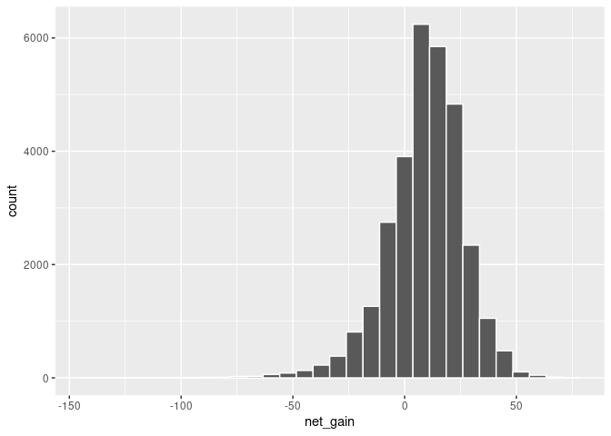
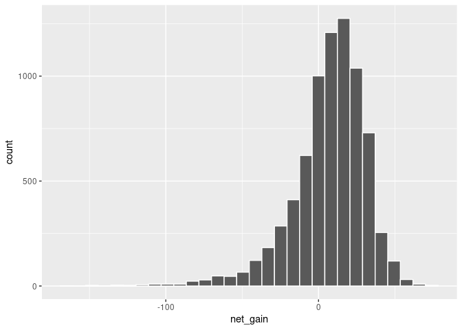
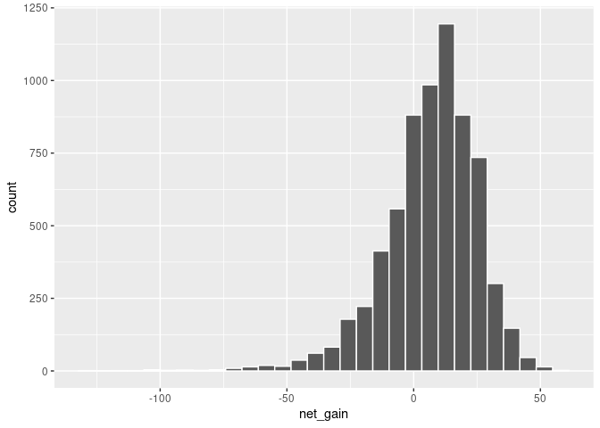
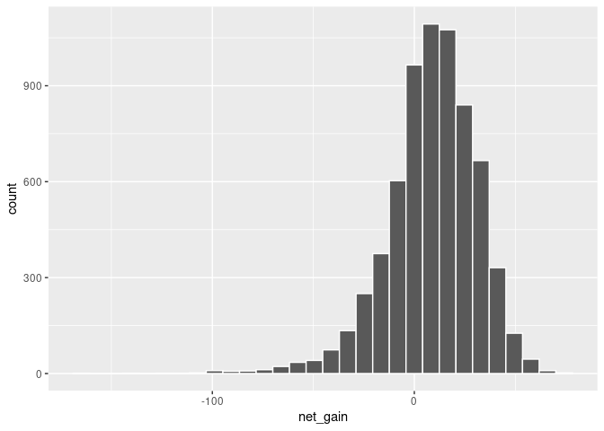
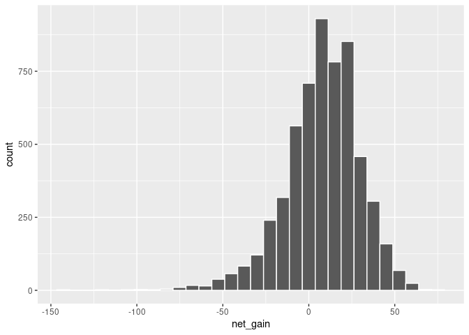
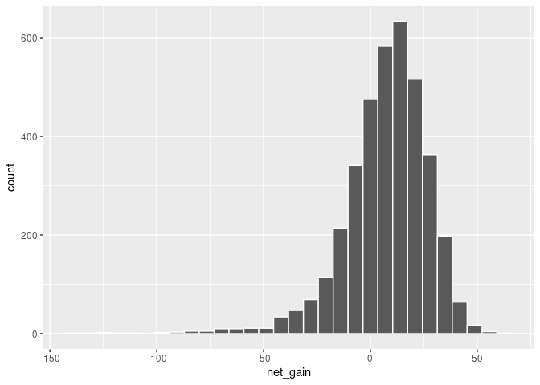
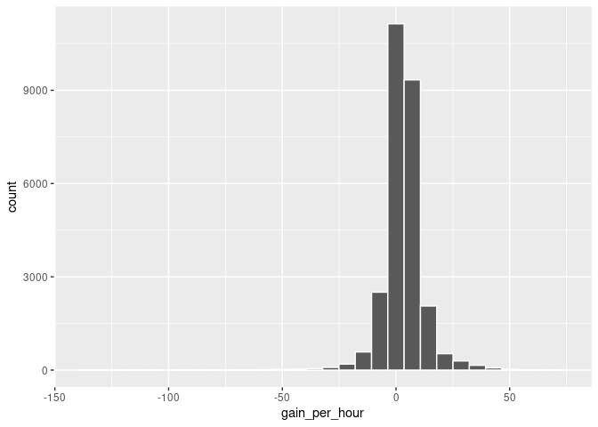
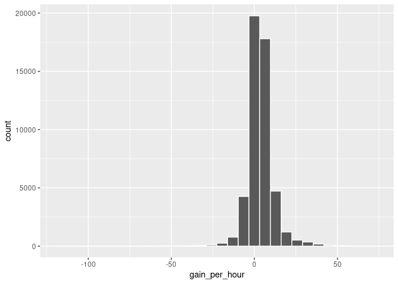
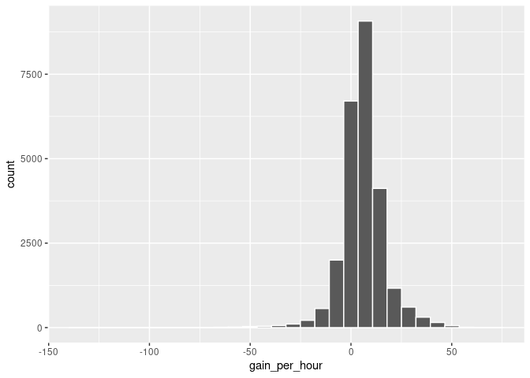
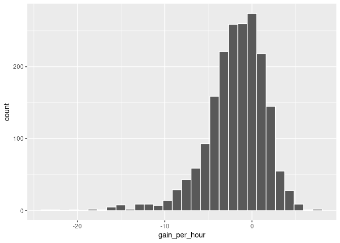

---

---

# United Airines(UA) Advanced Analysis Based On Gain Per Flight

``` r
library(nycflights13)
library(tidyverse)
```

```         
## ── Attaching core tidyverse packages ──────────────────────── tidyverse 2.0.0 ──
## ✔ dplyr     1.1.4     ✔ readr     2.1.5
## ✔ forcats   1.0.0     ✔ stringr   1.5.1
## ✔ ggplot2   3.5.1     ✔ tibble    3.2.1
## ✔ lubridate 1.9.3     ✔ tidyr     1.3.1
## ✔ purrr     1.0.2     
## ── Conflicts ────────────────────────────────────────── tidyverse_conflicts() ──
## ✖ dplyr::filter() masks stats::filter()
## ✖ dplyr::lag()    masks stats::lag()
## ℹ Use the conflicted package (<http://conflicted.r-lib.org/>) to force all conflicts to become errors
```

``` r
#View(flights)
```

``` r
#glimpse(flights)
```

``` r
UAflights<-flights%>%
  filter(carrier=="UA")
#glimpse(UAflights)
```

``` r
UAflights<-na.omit(UAflights)
```

``` r
UAflights <- UAflights %>% 
  mutate(net_gain = dep_delay-arr_delay)
```

``` r
#glimpse(UAflights)
```

``` r
UAflights <- UAflights %>% 
  mutate(
    late=ifelse(dep_delay>0, "TR", "FA")
    
  )
```

``` r
UAflights <- UAflights %>% 
  mutate(
    very_late=ifelse(dep_delay>30, "TR", "FA")
    
  )
#glimpse(UAflights)
```

1)Does the average gain differ for flights that departed late versus those that did not? What about for flights that departed more than 30 minutes late?

-\>for flights that departed late versus those that did not

NULL: meanGain_departedLate=meanGain_departedNotLate ALTERNATIVE: meanGain_departedLate!=meanGain_departedNotLate

As our sample size is large, we can use t test for entire project

``` r
print(t.test(net_gain~late,data=UAflights, alternative = "two.sided"))
```

```         
## 
##  Welch Two Sample t-test
## 
## data:  net_gain by late
## t = 10.749, df = 52833, p-value < 2.2e-16
## alternative hypothesis: true difference in means between group FA and group TR is not equal to 0
## 95 percent confidence interval:
##  1.411308 2.040805
## sample estimates:
## mean in group FA mean in group TR 
##         9.269172         7.543115
```

As p value is \< than 0.05, so reject null hypothesis There is evidence for mean gain of departed late flights different from mean gain of not departed late flights

``` r
latef<-UAflights %>%
  filter(late=="TR")
ggplot(data = latef, mapping = aes(x = net_gain)) +
  geom_histogram(color = "white")
```

```         
## `stat_bin()` using `bins = 30`. Pick better value with `binwidth`.
```

<!-- -->

``` r
notLate<-UAflights %>%
  filter(late=="FA")
ggplot(data = notLate, mapping = aes(x = net_gain)) +
  geom_histogram(color = "white")
```

```         
## `stat_bin()` using `bins = 30`. Pick better value with `binwidth`.
```

<!-- -->

Based on shape of above two graphs, average gain may differ for flights that departed late versus those that did not

-\>for flights that departed more than 30 minutes late

NULL: meanGain_departedMoreThan30MinsLate=meanGain_didNotdepartedMoreThan30MinsLate ALTERNATIVE: meanGain_departedMoreThan30MinsLate!=meanGain_didNotdepartedMoreThan30MinsLate

``` r
t.test(net_gain~very_late,data=UAflights, alternative = "two.sided") 
```

```         
## 
##  Welch Two Sample t-test
## 
## data:  net_gain by very_late
## t = 6.2953, df = 8838.6, p-value = 3.215e-10
## alternative hypothesis: true difference in means between group FA and group TR is not equal to 0
## 95 percent confidence interval:
##  1.268195 2.415112
## sample estimates:
## mean in group FA mean in group TR 
##         8.699534         6.857881
```

As p value is \< than 0.05, so reject null hypothesis There is evidence for mean gain of flights departed more than 30 minutes late different from mean gain of flights that did not depart more than 30 minutes late

``` r
latef<-UAflights %>%
  filter(very_late=="TR")
ggplot(data = latef, mapping = aes(x = net_gain)) +
  geom_histogram(color = "white")
```

```         
## `stat_bin()` using `bins = 30`. Pick better value with `binwidth`.
```

<!-- -->

``` r
notLate<-UAflights %>%
  filter(very_late=="FA")
ggplot(data = notLate, mapping = aes(x = net_gain)) +
  geom_histogram(color = "white")
```

```         
## `stat_bin()` using `bins = 30`. Pick better value with `binwidth`.
```

<!-- --> Based on shape of above two graphs, average gain may differ for flights that departed more than 30 minutes late versus those that did not

2)What are the five most common destination airports for United Airlines flights from New York City? Describe the distribution and the average gain for each of these five airports.

``` r
#glimpse(UAflights)
```

``` r
#glimpse(airports)
```

``` r
#View(UAflights)
```

``` r
#View(airports)
```

``` r
UAflights_JoinAirport <- UAflights %>% 
  inner_join(airports, by = c("dest" = "faa"))
#View(UAflights_JoinAirport)
```

``` r
UAflights_JoinAirport<-na.omit(UAflights_JoinAirport)
```

``` r
#glimpse(UAflights_JoinAirport)
```

``` r
mostCommon<-UAflights_JoinAirport%>%
  group_by(name) %>%
  summarize(count = n())
#mostCommon
```

``` r
#View(UAflights_JoinAirport)
```

``` r
topr<-mostCommon %>% 
  arrange(desc(count))
#topr
```

``` r
top5<-head(topr,5)
top5
```

```         
## # A tibble: 5 × 2
##   name                         count
##   <chr>                        <int>
## 1 George Bush Intercontinental  6814
## 2 Chicago Ohare Intl            6744
## 3 San Francisco Intl            6728
## 4 Los Angeles Intl              5770
## 5 Denver Intl                   3737
```

``` r
top5$name
```

```         
## [1] "George Bush Intercontinental" "Chicago Ohare Intl"          
## [3] "San Francisco Intl"           "Los Angeles Intl"            
## [5] "Denver Intl"
```

The five most common destination airports for United Airlines flights from New York City are:

1)George Bush Intercontinental 2)Chicago Ohare Intl 3)San Francisco Intl 4)Los Angeles Intl 5)Denver Intl

Distribution and the average gain for each of these five airports:

-\>1)George Bush Intercontinental

``` r
george<-UAflights_JoinAirport %>%
  filter(name=="George Bush Intercontinental")
ggplot(data = george, mapping = aes(x = net_gain)) +
  geom_histogram(color = "white")
```

```         
## `stat_bin()` using `bins = 30`. Pick better value with `binwidth`.
```

<!-- -->

The distribution is left skewed

``` r
mean(george$net_gain)
```

```         
## [1] 6.861755
```

The average net_gain is least among list of average net_gain of top five most common destination airports for United Airlines flights from New York City

``` r
t.test(george$net_gain)$conf
```

```         
## [1] 6.423820 7.299691
## attr(,"conf.level")
## [1] 0.95
```

With 95% confidence, the mean net_gain of flights to George Bush Intercontinental airport is between 6.423820 and 7.299691

-\>For 2)Chicago Ohare Intl

``` r
chicago<-UAflights_JoinAirport %>%
  filter(name=="Chicago Ohare Intl")
ggplot(data = chicago, mapping = aes(x = net_gain)) +
  geom_histogram(color = "white")
```

```         
## `stat_bin()` using `bins = 30`. Pick better value with `binwidth`.
```

<!-- -->

``` r
#glimpse(chicago)
```

The distribution is left skewed

``` r
mean(chicago$net_gain)
```

```         
## [1] 7.777432
```

The average net_gain is third highest among list of average net_gain of top five most common destination airports for United Airlines flights from New York City

``` r
t.test(chicago$net_gain)$conf
```

```         
## [1] 7.320135 8.234729
## attr(,"conf.level")
## [1] 0.95
```

With 95% confidence, the mean net_gain of flights to Chicago Ohare Intl airport is between 7.320135 and 8.234729

3)San Francisco Intl

``` r
san<-UAflights_JoinAirport %>%
  filter(name=="San Francisco Intl")
ggplot(data = san, mapping = aes(x = net_gain)) +
  geom_histogram(color = "white")
```

```         
## `stat_bin()` using `bins = 30`. Pick better value with `binwidth`.
```

<!-- --> The distribution is left skewed

``` r
mean(san$net_gain)
```

```         
## [1] 8.695006
```

The average net_gain is highest among list of average net_gain of top five most common destination airports for United Airlines flights from New York City

``` r
t.test(san$net_gain)$conf
```

```         
## [1] 8.159475 9.230536
## attr(,"conf.level")
## [1] 0.95
```

With 95% confidence, the mean net_gain of flights to San Francisco Intl airport is between 8.159475 and 9.230536

4)Los Angeles Intl

``` r
los<-UAflights_JoinAirport %>%
  filter(name=="Los Angeles Intl")
ggplot(data = los, mapping = aes(x = net_gain)) +
  geom_histogram(color = "white")
```

```         
## `stat_bin()` using `bins = 30`. Pick better value with `binwidth`.
```

<!-- --> The distribution is left skewed

``` r
mean(los$net_gain)
```

```         
## [1] 7.825303
```

The average net_gain is second highest among list of average net_gain of top five most common destination airports for United Airlines flights from New York City

``` r
t.test(los$net_gain)$conf
```

```         
## [1] 7.259681 8.390925
## attr(,"conf.level")
## [1] 0.95
```

With 95% confidence, the mean net_gain of flights to Los Angeles Intl airport is between 7.259681 and 8.390925

5)Denver Intl

``` r
den<-UAflights_JoinAirport %>%
  filter(name=="Denver Intl")
ggplot(data = den, mapping = aes(x = net_gain)) +
  geom_histogram(color = "white")
```

```         
## `stat_bin()` using `bins = 30`. Pick better value with `binwidth`.
```

<!-- --> The distribution is left skewed

``` r
mean(den$net_gain)
```

```         
## [1] 7.302382
```

The average net_gain is fourth highest among list of average net_gain of top five most common destination airports for United Airlines flights from New York City

``` r
t.test(den$net_gain)$conf
```

```         
## [1] 6.659348 7.945415
## attr(,"conf.level")
## [1] 0.95
```

With 95% confidence, the mean net_gain of flights to Denver Intl airport is between 6.659348 and 7.945415

3)Another common measure of interest, in addition to total gain, is the gain relative to the duration of the flight. Calculate the gain per hour by dividing the total gain by the duration in hours of each flight. Does the average gain per hour differ for flights that departed late versus those that did not? What about for flights that departed more than 30 minutes late?

``` r
#glimpse(UAflights)
```

``` r
#View(UAflights)
```

``` r
UAflights <- UAflights %>% 
  mutate(duration_in_hours = air_time/60)
```

``` r
UAflights <- UAflights %>% 
  mutate(gain_per_hour = net_gain/duration_in_hours)
```

``` r
#glimpse(UAflights)
```

-\>Does the average gain per hour differ for flights that departed late versus those that did not?

NULL: meanGainPerHour_late=meanGainPerHour_notLate ALTERNATIVE: meanGainPerHour_late!=meanGainPerHour_notLate

``` r
t.test(gain_per_hour~late,data=UAflights, alternative = "two.sided") 
```

```         
## 
##  Welch Two Sample t-test
## 
## data:  gain_per_hour by late
## t = 11.285, df = 53125, p-value < 2.2e-16
## alternative hypothesis: true difference in means between group FA and group TR is not equal to 0
## 95 percent confidence interval:
##  0.6662688 0.9463657
## sample estimates:
## mean in group FA mean in group TR 
##         3.990898         3.184581
```

As p value\<0.05, we reject null hypothesis We have evidence that mean Gain per hour for flights departed late differs from mean gain per hour for flights did not depart late

``` r
#glimpse(UAflights)
```

``` r
latef<-UAflights %>%
  filter(late=="TR")
ggplot(data = latef, mapping = aes(x = gain_per_hour)) +
  geom_histogram(color = "white")
```

```         
## `stat_bin()` using `bins = 30`. Pick better value with `binwidth`.
```

<!-- -->

``` r
latef<-UAflights %>%
  filter(late=="FA")
ggplot(data = latef, mapping = aes(x = gain_per_hour)) +
  geom_histogram(color = "white")
```

```         
## `stat_bin()` using `bins = 30`. Pick better value with `binwidth`.
```

<!-- --> Based on shape of above graphs,the average gain per hour may differ for flights that departed late versus those that did not

-\>What about for flights that departed more than 30 minutes late?

NULL: meanGainPerHour_moreThan30late=meanGainPerHour_notMoreThan30Late ALTERNATIVE: meanGainPerHour_moreThan30late!=meanGainPerHour_notMoreThan30Late

``` r
t.test(gain_per_hour~very_late,data=UAflights, alternative = "two.sided") 
```

```         
## 
##  Welch Two Sample t-test
## 
## data:  gain_per_hour by very_late
## t = 4.8323, df = 8835.1, p-value = 1.372e-06
## alternative hypothesis: true difference in means between group FA and group TR is not equal to 0
## 95 percent confidence interval:
##  0.3745605 0.8858401
## sample estimates:
## mean in group FA mean in group TR 
##         3.694727         3.064527
```

As p value\<0.05, we reject null hypothesis We have evidence that mean gain per hour for flights departed more than 30 mins late is different from mean gain per hour for flights departed not more than 30 mins late

``` r
latef<-UAflights %>%
  filter(very_late=="TR")
ggplot(data = latef, mapping = aes(x = gain_per_hour)) +
  geom_histogram(color = "white")
```

```         
## `stat_bin()` using `bins = 30`. Pick better value with `binwidth`.
```

<!-- -->

``` r
latef<-UAflights %>%
  filter(very_late=="FA")
ggplot(data = latef, mapping = aes(x = gain_per_hour)) +
  geom_histogram(color = "white")
```

```         
## `stat_bin()` using `bins = 30`. Pick better value with `binwidth`.
```

<!-- --> Based on shape of above graphs,the average gain per hour may differ for flights that departed more than 30 minutes late versus those that did not

4)Does the average gain per hour differ for longer flights versus shorter flights?

``` r
#View(UAflights)
```

``` r
#unique(UAflights$duration_in_hours)
```

``` r
max(UAflights$duration_in_hours)
```

```         
## [1] 11.58333
```

``` r
min(UAflights$duration_in_hours)
```

```         
## [1] 0.3833333
```

``` r
#glimpse(UAflights)
```

``` r
short_long<-UAflights %>%
  filter((duration_in_hours<=3) | (duration_in_hours>=6))
#short_long
```

``` r
#glimpse(short_long)
```

``` r
short_long <- short_long %>% 
  mutate(
    shorter_flight=ifelse(duration_in_hours<=3, "TR", "FA")
    
  )
```

NULL: average gain per hour for longer flights=average gain per hour for shorter flights ALTERNATIVE: average gain per hour for longer flights!=average gain per hour for shorter flights

``` r
#glimpse(short_long)
```

``` r
t.test(gain_per_hour~shorter_flight,data=short_long, alternative = "two.sided") 
```

```         
## 
##  Welch Two Sample t-test
## 
## data:  gain_per_hour by shorter_flight
## t = -72.665, df = 5974.9, p-value < 2.2e-16
## alternative hypothesis: true difference in means between group FA and group TR is not equal to 0
## 95 percent confidence interval:
##  -7.934479 -7.517613
## sample estimates:
## mean in group FA mean in group TR 
##        -1.864750         5.861295
```

As p value\<0.05, we reject null We have evidence for average gain per hour for longer flights different from average gain per hour for shorter flights

``` r
#glimpse(short_long)
```

``` r
latef<-short_long %>%
  filter(shorter_flight=="TR")
ggplot(data = latef, mapping = aes(x = gain_per_hour)) +
  geom_histogram(color = "white")
```

```         
## `stat_bin()` using `bins = 30`. Pick better value with `binwidth`.
```

<!-- -->

``` r
latef<-short_long %>%
  filter(shorter_flight=="FA")
ggplot(data = latef, mapping = aes(x = gain_per_hour)) +
  geom_histogram(color = "white")
```

```         
## `stat_bin()` using `bins = 30`. Pick better value with `binwidth`.
```

<!-- -->

Based on shape of above graphs, average gain per hour may differ for longer flights versus shorter flights
